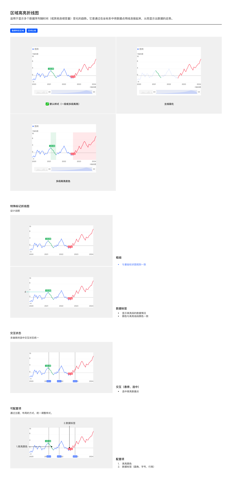

# 区域高亮折线图（Area-Highlight Line Chart）

## Overview

区域高亮折线图用于**强调特定时间区间或区域**的趋势——在基础折线图上叠加高亮线段（涨跌色）或高亮底色背景，标识需要关注的区段。

适用场景：

- 强调特定区域（如某段时间的涨跌阶段）
- 区间比较（多段不同性质的区间并列展示）

与同族图表的区别：基础折线图全段一色；多折线图多条对比；区域高亮折线图**单条折线但分段着色 / 加底色**。

---

## 变体（Variants）

| 变体 | 说明 |
| --- | --- |
| **默认样式（一段或多段高亮）** | 主线为单色（蓝），高亮区段用涨跌色（红/绿）替换主线颜色；区段两端有数值标签 |
| **主线弱化** | 主线降低透明度（约 30-40%），高亮区段保持完整颜色与不透明度 |
| **多段高亮底色** | 在高亮区段背景加涨跌色淡底（绿色淡底 = 上涨段 / 红色淡底 = 下跌段），主线和叠加底色都保留 |

---

## 图形规范（Shape Spec）

### 粗细

**与基础折线图规则一致**（PDF 原文写"与基础柱状图规则一致"系笔误；实际是折线图族）。

| 元素 | 值 | Token |
| --- | --- | --- |
| 主线描边 | 1.5px | `size-line-stroke` |
| 高亮区段描边 | 1.5px（同主线） | — |
| 数据点 | 6px（高亮区段两端显示） | `size-line-point` |

### 高亮色

| 区段类型 | 颜色 | Token |
| --- | --- | --- |
| 上涨段（正向） | `#FF2436` | `color-price-up` |
| 下跌段（负向） | `#07AB4B` | `color-price-down` |
| 高亮底色（上涨段背景） | 上涨色淡底（约 10-15% 透明度） | `color-price-up` + alpha |
| 高亮底色（下跌段背景） | 下跌色淡底 | `color-price-down` + alpha |
| 主线弱化变体的主线 | `color-visualization-primary` 降低到 30-40% 透明度 | — |

---

## 数据标签

| 规则 | 说明 |
| --- | --- |
| 显示位置 | 高亮区段的**两端**（起点 + 终点）显示数值 |
| 标签背景 | 跟随高亮区段颜色（涨段红色背景白字 / 跌段绿色背景白字） |
| 形状 | 圆角矩形胶囊 |
| 字号 / 字体 | 见 [数据标签规范](../components/data-label.md) |
| 颜色 | 与高亮线段颜色一致 |

---

## 交互状态（Interaction）

| 模式 | 说明 |
| --- | --- |
| **悬停 / 选中** | 选中点显示高亮数据点（同基础折线图） |

多端保持选中状态视觉统一。

---

## 可配置项（Configurable）

| # | 配置项 | 说明 |
| --- | --- | --- |
| 1 | 高亮颜色 | 涨跌色（默认）；可主题级覆盖 |
| 2 | 数据标签 | 圆角、字号、行高 |

---

## Tokens 引用清单

| Token | 用途 |
| --- | --- |
| `color-visualization-primary` | 主线色（默认） |
| `color-price-up` | 上涨高亮线段 / 涨段标签背景 |
| `color-price-down` | 下跌高亮线段 / 跌段标签背景 |
| `color-text-inverse` | 高亮区段标签胶囊内的白字 |
| `font-family-number` | 数据标签 / 轴数字 |
| `size-line-stroke` | 线段描边 1.5px |
| `size-line-point` | 数据点 6px |

---

## Examples

整页示意图包含：默认样式（一段或多段高亮）/ 主线弱化变体 / 多段高亮底色变体 / 粗细规则 / 数据标签（红绿胶囊）/ 交互-悬停 / 可配置项。

---

## 实现要点（库无关）

- **高亮段是主线的分段着色**：不是独立系列——按数据区间切分同一条主线并换色，连接处保持连续。
- **区间两端标数值胶囊**：高亮区间起止点显示数值胶囊，背景色跟随高亮段（涨红 / 跌绿）。
- **底色填充透明度极低**：多段高亮底色变体的背景填充约 10-15% 透明度，不遮挡折线。
- **主线弱化变体**：主线降透明度到 30-40%，高亮段保持完整不透明度。
- **数据点描边色跟随线段色**：高亮段两端 / 选中态数据点的描边色跟随所在线段颜色（涨段红 / 跌段绿），hover/选中态 fill 切换白色但**描边色不变**。
- **光标线在折线下方（z-index 特例）**：折线图族通用规则，详见 [base.md — 折线图 / 折柱组合特例](../themes/base.md#折线图--折柱组合特例重要)。

---

## Do & Don't

| | 规则 |
| --- | --- |
| ✅ | 高亮段必须用 `color-price-up` / `color-price-down`，不复用其他系列色 |
| ✅ | 高亮区段两端必须显示数据标签胶囊，颜色与线段一致 |
| ✅ | 主线弱化变体的主线透明度降到 30-40%，保持轮廓但不抢戏 |
| ✅ | 多段高亮底色时，底色透明度极低（10-15%），不遮挡折线 |
| ❌ | 不要在区域高亮折线图上使用 `color-status-error` / `color-status-success`——必须用涨跌色 |
| ❌ | 不要在高亮区段使用与主线相同的颜色——失去强调意义 |
| ❌ | 不要让高亮区段两端没有数据标签——区段意义无法量化 |

---

## 主题覆盖速查

本图表的颜色 / 字体 / 形态在业务线主题下可能被覆盖：

- **跨主题速查**：[themes/base.md § 被业务线主题覆盖项一览](../themes/base.md#被业务线主题覆盖项一览cross-theme-diff-map)
- **完整 delta 值**：[ifind.md](../themes/ifind.md)（iFinD-PC 静态图）/ [ainvest.md](../themes/ainvest.md)（含 Mobile / PC 分节）/ [ths.md](../themes/ths.md)（同时是 iFinD-Mobile 实现）

⚠️ 切了业务线主题画此图表时，**先**回上述主题文件确认本图表的颜色 / 字体 / 形态是否被覆盖；**未覆盖项**继承本文件 + base.md。色板维度**整套替换**不与 base 叠加（见 [SKILL.md § 维度叠加规则](../../SKILL.md#维度叠加规则)）。
