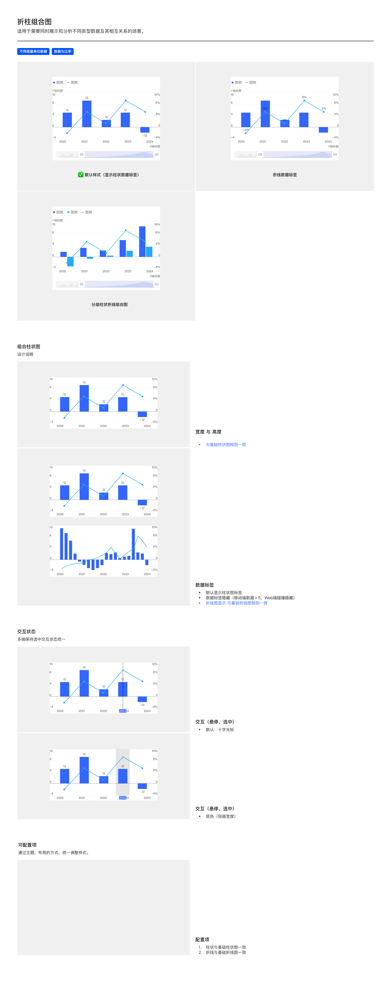

# 折柱组合图（Bar + Line Combo Chart）

## Overview

折柱组合图用于**同时展示和分析不同类型数据及其相互关系**——柱状表达一类数据（如绝对量），折线叠加表达另一类数据（如比率 / 比例 / 同比）。

适用场景：

- 不同度量单位数据并列（左轴绝对值，右轴百分比）
- 数量与比率关系（如季度营收柱 + 同比增长率折线）

---

## 变体（Variants）

| 变体 | 说明 |
| --- | --- |
| **默认样式（显示柱状数据标签）** | 柱顶显示数值，折线无标签 |
| **折线数据标签** | 折线节点处显示数值（柱顶可保留或隐藏） |
| **分组柱状折线组合图** | 多组柱 + 折线（基础柱→分组柱的扩展形态） |

---

## 图形规范（Shape Spec）

### 宽度与高度

**柱状部分**与基础柱状图规则一致，详见 [bar.md — 宽度](bar.md#宽度width) 与 [bar.md — 高度](bar.md#高度height)。

| 规则 | 值 | Token |
| --- | --- | --- |
| 柱体最大宽度 | 32px | `size-bar-max` |
| 单柱容器最大宽度 | 48px | `size-bar-container-max` |
| 柱距比 | 2:1 | `size-bar-bar-gap-ratio` |
| 图与数据标签最大占画布高度 | 95% | — |

**折线部分**与基础折线图规则一致（未来在 `line.md` 详述；当前可参考通用规范）。

### 柱顶圆角

| 属性 | 值 | Token |
| --- | --- | --- |
| 柱顶圆角 | 0px（无圆角） | `radius-bar-top` |

### Y 轴规则（关键差异）

折柱组合图**始终启用双 Y 轴**：

| Y 轴 | 数据来源 | 位置 | 对齐 |
| --- | --- | --- | --- |
| 主 Y 轴（左） | 柱状数据（如绝对量） | 图表左侧 | 右对齐 |
| 副 Y 轴（右） | 折线数据（如百分比 / 比率） | 图表右侧 | 左对齐 |

详见 [坐标轴规范](../components/axes.md)。

### 颜色

折柱组合图使用**独立的折柱组合图色板**——柱与折线分属两套子序列，避免柱 / 线同色。详见 [tokens.md — 折柱组合图色板](../tokens.md#可视化色板sequential-palette-核心)。

**柱状系列**（按序号取色）：

| 序号 | 颜色 | Token |
| --- | --- | --- |
| 1 | `#3366FF` | `color-visualization-primary` |
| 2 | `#14CCBD` | `color-visualization-04` |
| 3 | `#199FFF` | `color-visualization-05` |
| 4 | `#4433FF` | `color-visualization-06` |
| 5 | `#FF33AA` | `color-visualization-07` |
| 6 | `#CC41D9` | `color-visualization-08` |

**折线系列**（按序号取色）：

| 序号 | 颜色 | Token |
| --- | --- | --- |
| 1 | `#FF9500` | `color-visualization-02` |
| 2 | `#858585` | `color-visualization-09` |

> **规则**：柱第 1 色固定为 `color-visualization-primary`；柱多系列按 04 → 05 → 06 → 07 → 08 顺序取色。折线第 1 色固定为 `color-visualization-02`，第 2 色为 `color-visualization-09`。**禁止柱与折线交叉使用对方序列**。

---

## 数据标签

| 规则 | 说明 |
| --- | --- |
| 默认 | 显示柱状数据标签（柱顶） |
| 折线标签 | 变体「折线数据标签」启用时显示在折线节点 |
| 隐藏规则 | 移动端数据 > 5 隐藏；Web 端碰撞隐藏 |
| 折线图示 | 与基础折线图规则一致 |

---

## 交互状态（Interaction）

| 模式 | 说明 |
| --- | --- |
| **十字光标**（默认） | 悬停 / 选中柱时，垂直细线 + Tooltip 显示该位置的柱值和折线值 |
| **底色（容器宽度）** | 悬停 / 选中时整个柱容器宽度绘制半透明背景 |

Tooltip 同时列出柱系列和折线系列的数值（含单位），详见 [Tooltip 规范](../components/tooltip.md).

多端保持选中状态视觉统一。

---

## 可配置项（Configurable）

| # | 配置项 | 说明 |
| --- | --- | --- |
| 1 | 柱状配置 | 与基础柱状图一致（容器、圆角、数据标签） |
| 2 | 折线配置 | 与基础折线图一致（线宽、节点、平滑度） |

---

## Tokens 引用清单

| Token | 用途 |
| --- | --- |
| `color-visualization-primary` | 柱第 1 色（固定） |
| `color-visualization-04` / `-05` / `-06` / `-07` / `-08` | 柱第 2–6 色 |
| `color-visualization-02` | 折线第 1 色 |
| `color-visualization-09` | 折线第 2 色 |
| `color-background-weak` | 选中态底色 |
| `font-family-number` | 数据标签 / 双 Y 轴数字 |
| `font-family-cn` | 中文系列名 / 单位 |
| `size-bar-max` / `size-bar-container-max` / `size-bar-bar-gap-ratio` | 柱状尺寸 |
| `radius-bar-top` | 柱顶圆角 0px |

---

## Examples

整页示意图包含：默认样式（显示柱状数据标签）/ 折线数据标签变体 / 分组柱状折线组合图变体 / 宽度与高度（同基础柱状图）/ 数据标签 / 交互-悬停 / 交互-选中。

---

## 实现要点（库无关）

- **双轴独立量纲**：柱与折线分属左右两条 Y 轴，各自独立刻度——不要强行共用一轴。
- **柱与折线颜色必须区分**：柱固定用主色，叠加折线从色板第 2 色起依次取，避免与柱同色。
- **柱、折线规则各自继承**：柱部分沿用基础柱状图实现要点，折线部分沿用基础折线图实现要点。
- **折线数据点描边色跟随折线色**：hover / 选中态 fill 切换白色，**描边色保持折线色不变**——这是反馈高频踩中的坑（描边色错配会非常显眼）。详见 [line.md — 数据点描边](line.md#粗细)。

---

## Do & Don't

| | 规则 |
| --- | --- |
| ✅ | **始终启用双 Y 轴**：左轴柱数据，右轴折线数据 |
| ✅ | 柱按 primary → 04 → 05 → 06 → 07 → 08 取色，折线按 02 → 09 取色（折柱组合图色板） |
| ✅ | 柱状规则完全继承基础柱状图（32 / 48 / 2:1 / 95%） |
| ✅ | 折线规则完全继承基础折线图 |
| ✅ | Tooltip 同时显示柱值和折线值，分行排列 |
| ❌ | 不要给柱与折线使用相同颜色——会让两组数据无法区分 |
| ❌ | 不要在单 Y 轴上混排柱（绝对量）和折线（百分比）——量纲冲突 |
| ❌ | 不要让折线使用 `color-visualization-primary`（柱已占用）；折线必须从第 2 色起 |
| ❌ | 不要在柱顶标签和折线节点标签同时启用时不做碰撞检测 |

---

## 主题覆盖速查

本图表的颜色 / 字体 / 形态在业务线主题下可能被覆盖：

- **跨主题速查**：[themes/base.md § 被业务线主题覆盖项一览](../themes/base.md#被业务线主题覆盖项一览cross-theme-diff-map)
- **完整 delta 值**：[ifind.md](../themes/ifind.md)（iFinD-PC 静态图）/ [ainvest.md](../themes/ainvest.md)（含 Mobile / PC 分节）/ [ths.md](../themes/ths.md)（同时是 iFinD-Mobile 实现）

⚠️ 切了业务线主题画此图表时，**先**回上述主题文件确认本图表的颜色 / 字体 / 形态是否被覆盖；**未覆盖项**继承本文件 + base.md。色板维度**整套替换**不与 base 叠加（见 [SKILL.md § 维度叠加规则](../../SKILL.md#维度叠加规则)）。
