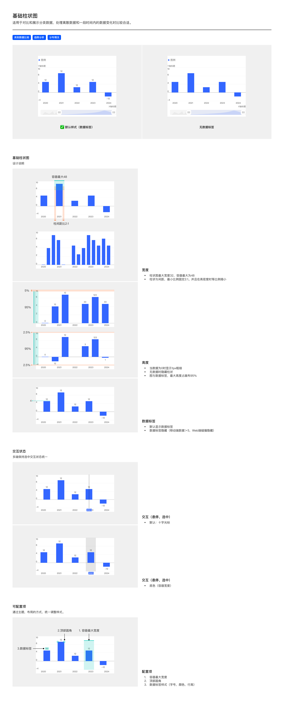

# 基础柱状图（Bar Chart）

## Overview

基础柱状图用于**对比和展示分类数据**，处理离散数据和一段时间内的数据变化时较合适。

适用场景：

- 类别数据比较（如 2020-2024 年逐年净利润）
- 趋势分析（同一指标在时间维度的演变）
- 分布情况（各类别下数值的离散分布）

与同族图表的区别：

| 图表       | 与基础柱状图的差异             |
| -------- | --------------------- |
| 分组柱状图    | 同一 X 类别下多个并列柱（多系列）    |
| 堆叠柱状图    | 同一 X 类别下多系列竖向堆叠       |
| 归一化堆叠柱状图 | 堆叠柱按 100% 归一化，展示各分量占比 |
| 折柱组合图    | 柱 + 叠加折线（双 Y 轴）       |
| 横向条形图    | X / Y 轴交换，分类在 Y 轴     |

---

## 变体（Variants）

| 变体              | 说明              |
| --------------- | --------------- |
| **默认样式（带数据标签）** | 每条柱顶部显示数值标签     |
| **无数据标签**       | 隐藏柱顶数值，仅由柱高呈现量级 |

变体切换通过主题 / 布局配置；详见下方 [可配置项](#可配置项configurable)。

---

## 图形规范（Shape Spec）

### 宽度（Width）

| 规则            | 值                                  | Token                    |
| ------------- | ---------------------------------- | ------------------------ |
| 柱体最大宽度        | 32px                               | `size-bar-max`           |
| 单柱容器最大宽度（含柱距） | 48px                               | `size-bar-container-max` |
| 柱体宽与柱间距比      | **2:1**（固定最小比例）                    | `size-bar-bar-gap-ratio` |
| 高密度处理         | 数据量较多时**等比例缩放**（柱体 + 柱间距同步缩小，比例不变） | —                        |

### 高度（Height）

| 规则            | 值                          |
| ------------- | -------------------------- |
| 图与数据标签最大占画布高度 | **95%**（顶部留 5% 间距，给数据标签喘息） |
| Y 轴负值区域       | 上下各占 2.5%（含正负数据时对称留白）      |
| 数据为 0         | 显示 **1px 粗细**的柱条占位         |
| 无数据 / null    | 完全隐藏该位置柱状                  |

### 柱顶圆角

| 属性   | 值    | Token            |
| ---- | ---- | ---------------- |
| 顶部圆角 | 0px  | `radius-bar-top` |
| 底部圆角 | 0px  | —                |

柱体四角均为直角，不设圆角。

### 颜色

| 场景                   | 颜色        | Token                                                                                        |
| -------------------- | --------- | -------------------------------------------------------------------------------------------- |
| 默认单色柱（单系列基础柱状图）      | `#3366FF` | `color-visualization-primary`                                                                                 |
| 多系列（不在基础柱图范围，见分组柱状图） | 按顺序色板分配   | 见 [图例规范](../components/legend.md) 与 [tokens.md — 可视化色板](../tokens.md#可视化色板sequential-palette-核心) |

> 禁止硬编码 `#3366FF`，必须用 `color-visualization-primary` token 引用。

---

## 数据标签（Data Label）

| 规则 | 说明 |
| --- | --- |
| 默认行为 | 显示在柱顶（负值柱显示在柱底） |
| 字号 / 字体 / 颜色 | 见 [数据标签规范](../components/data-label.md) |
| 隐藏规则 — 移动端 | 数据量 > 5 时隐藏 |
| 隐藏规则 — Web 端 | 碰撞隐藏（标签重叠时自动隐藏） |
| 0 值显示 | 显示「0」 |
| 无数据显示 | 不显示标签 |

---

## 交互状态（Interaction）

多端保持选中状态视觉统一。共有两种交互模式：

### 模式一：十字光标（默认）

悬停 / 选中柱条时：

- 在当前柱中心绘制**垂直细线**（贯穿图表绘制区上下）
- 与轴交点处可绘制 X 轴标签胶囊（视配置而定）
- 该柱被选中标识：当前柱颜色加深 / 其余柱降低透明度
- 触发 Tooltip 气泡显示（见 [Tooltip 规范](../components/tooltip.md)）

### 模式二：底色（容器宽度）

悬停 / 选中柱条时：

- 在该柱**整个容器宽度**（含柱距，48px 上限）绘制半透明背景
- 背景色 `color-background-weak`（`rgba(0,0,0,0.04)`）
- 适用于点击选中态长期保持的场景（如图表上选某一年数据驱动其他模块联动）

两种模式可单独使用或组合（点击选中用底色 + 悬停用十字光标）。

---

## 可配置项（Configurable）

设计师可通过主题 / 布局配置统一调整以下项，**不属于硬规范**：

| # | 配置项 | 说明 |
| --- | --- | --- |
| 1 | 容器最大宽度 | 默认 48px，可按业务调整（如桌面端可放宽到 64px） |
| 2 | 柱顶圆角 | 默认 0px（直角），可按品牌需求调整 |
| 3 | 数据标签样式 | 字号、颜色、行高可主题级调整 |

调整后需在项目级 tokens 文件覆盖默认值，**不要在组件代码里硬编码新值**。

---

## Tokens 引用清单

本图表用到的 token（其余共享 token 见 [tokens.md](../tokens.md)）：

| Token | 用途 |
| --- | --- |
| `color-visualization-primary` | 默认柱色 |
| `color-text-primary` | 浅底数据标签颜色 |
| `color-text-secondary` | 轴标签颜色 |
| `color-background-weak` | 选中态底色背景 |
| `color-visualization-divider` | 网格线 |
| `font-family-number` | 数据标签 / Y 轴 / X 轴数字 |
| `font-family-cn` | 中文 X 轴标题、Y 轴标题（非数字部分） |
| `size-bar-max` | 柱体最大宽度 32px |
| `size-bar-container-max` | 单柱容器最大宽度 48px |
| `size-bar-bar-gap-ratio` | 柱距比 2:1 |
| `radius-bar-top` | 柱顶圆角 0px |

---

## Examples

整页示意图包含：默认样式 vs 无数据标签 / 宽度规则 / 高度规则 / 数据标签 / 交互-悬停 / 交互-选中 / 可配置项 7 个区块。

---

## 实现要点（库无关）

用任意图表库（ECharts / AntV G2 / D3 / Recharts 等）落地基础柱状图时的关键注意点：

- **柱宽用「最大宽度」语义**：设柱体宽度上限而非固定宽度。数据增多时柱体与间距同步等比缩小，始终维持 2:1——不要写死柱宽导致数据密集时溢出。
- **柱距用比例而非绝对像素**：柱间距表达为柱宽的百分比，确保不同数据量下视觉一致。
- **0 值退化为细线**：数据为 0 时不要画成 0 高度（视觉消失），退化为细线占位，保留「该位置有数据」的信息；无数据才完全隐藏。
- **数据标签碰撞检测**：标签重叠时按规则隐藏（移动端 > 5 个、Web 端碰撞），不要强制全显。
- **柱体不设圆角**：四角均为直角（`radius-bar-top: 0px`）。

---

## Do & Don't

| | 规则 |
| --- | --- |
| ✅ | 柱体 32 / 容器 48 / 柱距比 2:1，高密度时按比例等比缩放 |
| ✅ | 柱体四角直角，不设圆角 |
| ✅ | 数据为 0 时显示 1px 占位，无数据时完全隐藏 |
| ✅ | 图与数据标签最大占画布 95%，顶部留 5% 喘息 |
| ✅ | 数据标签字体用 `font-family-number`，颜色用 `color-text-primary` |
| ✅ | 选中态可用「十字光标」或「容器宽度底色」，多端保持一致 |
| ❌ | 不要硬编码柱色 `#3366FF`，用 `color-visualization-primary` token |
| ❌ | 不要硬编码柱宽 / 间距比，用 `size-bar-*` token |
| ❌ | 不要在移动端数据 > 5 时仍强制显示所有数据标签 —— 会碰撞 |
| ❌ | 不要给柱体加圆角——柱体应为直角 |
| ❌ | 不要把基础柱状图改成多系列并列（那是分组柱状图） |
| ❌ | 不要复用 `color-status-info` 作为柱色——它是状态色，不是图表系列色 |

---

## 主题覆盖速查

本图表的颜色 / 字体 / 形态在业务线主题下可能被覆盖：

- **跨主题速查**：[themes/base.md § 被业务线主题覆盖项一览](../themes/base.md#被业务线主题覆盖项一览cross-theme-diff-map)
- **完整 delta 值**：[ifind.md](../themes/ifind.md)（iFinD-PC 静态图）/ [ainvest.md](../themes/ainvest.md)（含 Mobile / PC 分节）/ [ths.md](../themes/ths.md)（同时是 iFinD-Mobile 实现）

⚠️ 切了业务线主题画此图表时，**先**回上述主题文件确认本图表的颜色 / 字体 / 形态是否被覆盖；**未覆盖项**继承本文件 + base.md。色板维度**整套替换**不与 base 叠加（见 [SKILL.md § 维度叠加规则](../../SKILL.md#维度叠加规则)）。
