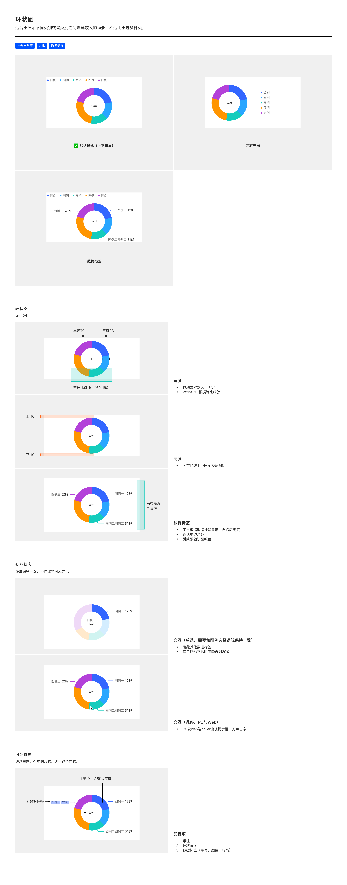

# 环状图（Donut Chart）

## Overview

环状图（环图、Donut）用于展示**不同类别或类别之间差异较大的场景**——结构同饼图但中间挖空，**可在中心填写 `text`**（如总额、概要文字、关键指标）。

适用场景：

- 比例与份额
- 占比
- 数据标签

> **不适用**：过多种类（结构与饼图一致，超过 5-7 个扇区视觉拥挤）。

与同族图表的区别：

| 图表 | 区别 |
| --- | --- |
| 饼图 | 实心，无中心空白 |
| 半环状图 | 仅显示上半部 |

---

## 变体（Variants）

| 变体 | 说明 |
| --- | --- |
| **默认样式（上下布局）** | 图例在上，环图在下 |
| **左右布局** | 图例在右，环图在左 |
| **数据标签** | 在环图各扇区外侧标注「图例名 数值」（带引线） |

---

## 图形规范（Shape Spec）

### 宽度

| 规则 | 值 | Token |
| --- | --- | --- |
| 移动端容器大小 | **固定**（容器比例 1:1，160×160px） | `size-donut-container` |
| Web & PC | 根据等比缩放 | — |
| 半径 | **70px** | `size-donut-radius` |
| 环宽（环形粗细） | **28px** | `size-donut-ring-width` |

### 高度

| 规则 | 值 |
| --- | --- |
| 画布区域上下固定预留间距 | 上 **10px** / 下 **10px** |
| 画布根据数据标签显示，**自适应高度** | — |

---

## 数据标签（Data Label）

| 规则 | 说明 |
| --- | --- |
| 默认显示 | 是 |
| 默认对齐 | **单边对齐**（同一侧的多个标签竖向排列，对齐为列） |
| 引线 | **跟随扇区颜色**（每条引线颜色 = 对应扇区颜色，**必有引导线**，不可省略） |
| 引线起点距环图边缘 | **默认 +8px**（避免标签与环图重叠） |
| 标签内容 | `图例名 数值`（如「图例三 3289」） |
| 字号 / 字体 / 颜色 | 见 [数据标签规范](../components/data-label.md) |

---

## 中心文字

环图中心可填写文字（`text`）——常用于显示总额、关键指标、占比汇总等。文字样式由业务自定义（字号、字重、行高），无固定规范。

---

## 颜色

各扇区按顺序色板分配，同饼图。详见 [tokens.md — 可视化色板](../tokens.md)。

> **扇区之间无白色分割 / 边框**——直接由颜色区分扇区，相接处不画线条。

---

## 交互状态（Interaction）

| 模式 | 说明 |
| --- | --- |
| **单选**（与图例选择逻辑保持一致） | 隐藏其他扇区的数据标签；其余环形**不透明度降低到 20%**；被选中扇区保持完整不透明度 |
| **悬停（PC & Web）** | hover 出现提示框（Tooltip），**无点击态** |
| **移动端** | 多端保持选中视觉一致；不同业务可差异化 |

---

## 可配置项（Configurable）

| # | 配置项 | 说明 |
| --- | --- | --- |
| 1 | 半径 | 默认 70px |
| 2 | 环状宽度 | 默认 28px |
| 3 | 数据标签 | 字号、颜色、行高 |

---

## Tokens 引用清单

| Token | 用途 |
| --- | --- |
| `color-visualization-primary` / `color-visualization-02` / `color-visualization-09` 等 | 扇区色（顺序色板） |
| `font-family-number` | 数据标签数字 / 中心文字数字 |
| `font-family-cn` | 中文图例名 / 中心文字 |
| `size-donut-container` | 容器 160×160 (移动端) |
| `size-donut-radius` | 半径 70px |
| `size-donut-ring-width` | 环宽 28px |

---

## Examples

整页示意图包含：默认样式（上下布局）/ 左右布局 / 数据标签变体 / 宽度（容器 160×160，半径 70，环宽 28）/ 高度（上下 10 间距，自适应）/ 数据标签规则 / 交互-单选 / 交互-悬停 / 可配置项。

---

## 实现要点（库无关）

- **移动端容器固定、Web 等比缩放**：移动端用固定尺寸（1:1），Web/PC 根据可用空间等比缩放——不要在移动端做等比缩放。
- **数据标签单边对齐 + 引线跟随扇区**：同侧标签竖向对齐成列；引线颜色与所属扇区一致。
- **中心文字受内径限制**：环图中心文字长度不能超出内径范围，否则被外环遮挡。
- **单选交互**：选中扇区保持完整，其余扇区降不透明度到 20%。

---

## Do & Don't

| | 规则 |
| --- | --- |
| ✅ | 移动端容器固定 160×160，1:1 比例；Web/PC 等比缩放 |
| ✅ | 半径 70 + 环宽 28（外径 70、内径 42） |
| ✅ | 上下各预留 10px 间距，画布根据标签自适应高度 |
| ✅ | 数据标签默认单边对齐，引线跟随扇区颜色 |
| ✅ | 单选交互：选中扇区保持，其余降不透明度到 20% |
| ✅ | PC/Web hover 出 Tooltip，无点击态 |
| ❌ | 不要在移动端等比缩放容器——移动端固定大小 |
| ❌ | 不要让引线统一一色——必须跟随扇区颜色 |
| ❌ | 不要让其余扇区不透明度 < 20%——会看不见轮廓 |
| ❌ | 不要在环图中心放过长文字——超出内径会被外圈遮挡 |

---

## 主题覆盖速查

本图表的颜色 / 字体 / 形态在业务线主题下可能被覆盖：

- **跨主题速查**：[themes/base.md § 被业务线主题覆盖项一览](../themes/base.md#被业务线主题覆盖项一览cross-theme-diff-map)
- **完整 delta 值**：[ifind.md](../themes/ifind.md)（iFinD-PC 静态图）/ [ainvest.md](../themes/ainvest.md)（含 Mobile / PC 分节）/ [ths.md](../themes/ths.md)（同时是 iFinD-Mobile 实现）

⚠️ 切了业务线主题画此图表时，**先**回上述主题文件确认本图表的颜色 / 字体 / 形态是否被覆盖；**未覆盖项**继承本文件 + base.md。色板维度**整套替换**不与 base 叠加（见 [SKILL.md § 维度叠加规则](../../SKILL.md#维度叠加规则)）。
