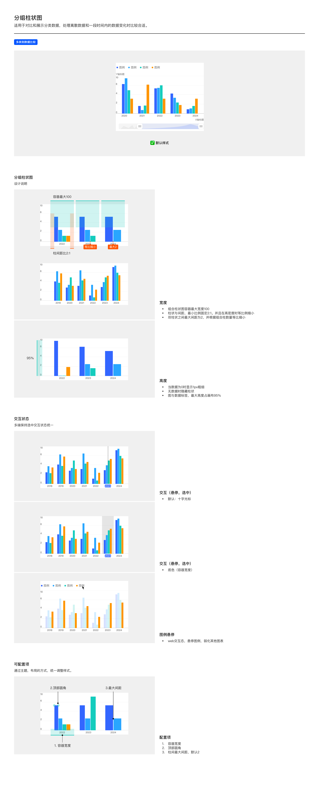

# 分组柱状图（Grouped Bar Chart）

## Overview

分组柱状图用于**多类别数据比较** —— 同一 X 类别下并列多个系列的柱条，便于横向对比。

适用场景：

- 多类别数据比较（如 2020-2024 年各产品线的同期对比）
- 多系列在时间维度的并列演变

与基础柱状图的区别：基础柱状图同一 X 位置只有一条柱（单系列）；分组柱状图同一 X 位置有 N 条并列柱（N 个系列）。

---

## 变体（Variants）

| 变体 | 说明 |
| --- | --- |
| **默认样式** | 同一 X 类别下并列多柱（2 / 3 / 4 / 5 柱组合） |

组合柱数量按数据系列动态决定，无独立变体名。

---

## 图形规范（Shape Spec）

### 宽度（Width）

| 规则 | 值 | Token |
| --- | --- | --- |
| 组合柱容器最大宽度 | **100px**（整个分组的水平容器上限） | `size-bar-group-container-max` |
| 单柱体最大宽度 | 32px（同基础柱状图） | `size-bar-max` |
| 柱体宽与柱间距比 | **2:1**（高密度时等比缩小） | `size-bar-bar-gap-ratio` |
| 双柱状之间最大间距 | **2px**（组内相邻柱之间）；根据组合柱数量等比缩小 | `size-bar-group-inner-gap-max` |

> 「组合柱容器 100px」与基础柱状图「单柱容器 48px」不同：前者是整个分组（含 N 个柱 + N-1 个内间距）的水平空间上限。

### 组间距（相邻分组之间）

| 规则 | 说明 |
| --- | --- |
| 组内相邻柱间距 | 柱宽的 **50%**（即柱宽 : 柱间距 = 2:1） |
| 相邻分组间距 | 多组并列时，相邻两个分组之间留约 **1 个柱宽**的空隙；组内柱数越多，分组间距越窄（等比收敛） |
| 单组（退化为基础柱状图） | 相邻类目间距取「类目带宽的约 1/3」 |

> 实现参考：分组间距 = `2 / ((分组数 + 1) × 1.5)` 的比例值。核心意图——分组之间的留白始终视觉清晰，不随系列增多而糊在一起。

### 高度（Height）

| 规则 | 值 |
| --- | --- |
| 图与数据标签最大占画布高度 | **95%** |
| 数据为 0 | 显示 **1px 粗细**的柱条占位 |
| 无数据 / null | 完全隐藏该位置柱状 |

> 高度规则与基础柱状图一致，详见 [bar.md — 高度](bar.md#高度height)。

### 柱顶圆角

| 属性 | 值 | Token |
| --- | --- | --- |
| 所有圆角 | 0px（无圆角） | `radius-bar-top` |

### 颜色

分组柱状图多系列，按**柱图色板**顺序分配颜色。

> 柱图色板**直接使用折线色板**（详见 [tokens.md — 色板拆分](../tokens.md)）：`color-visualization-primary` → `-02` → `-08` → `-04` → `-05` → `-09`。同一系列在所有分组中颜色一致。

---

## 数据标签

分组柱状图**默认不显示**数据标签（多柱并列时标签易碰撞，PDF 默认样式未显示）。若启用需遵循 [数据标签规范](../components/data-label.md) 的字号 / 颜色 / 字体规则。

---

## 交互状态（Interaction）

| 模式 | 说明 |
| --- | --- |
| **十字光标**（默认） | 悬停 / 选中时，整组柱用垂直细线标识；Tooltip 显示该组所有系列数值 |
| **底色（容器宽度）** | 悬停 / 选中时，整个组合容器宽度（100px 上限）绘制半透明背景 |
| **图例悬停（Web 端）** | 悬停某条图例时，**该系列突出，其他系列弱化**（降低透明度） |

多端保持选中状态视觉统一。

> 「图例悬停弱化」是分组柱状图、堆叠柱状图等多系列图表特有的 Web 交互态，详见 [图例悬停规范](../components/legend.md#图例悬停web-端).

---

## 可配置项（Configurable）

| # | 配置项 | 说明 |
| --- | --- | --- |
| 1 | 容器宽度 | 默认组合容器 100px，可调 |
| 2 | 顶部圆角 | 默认 0px（无圆角） |
| 3 | 柱间最大间距 | 默认 2px（组内相邻柱），可调 |

---

## Tokens 引用清单

| Token | 用途 |
| --- | --- |
| `color-visualization-primary` / `color-visualization-02` / `color-visualization-09` | 系列色（按顺序色板分配） |
| `color-background-weak` | 选中态底色 |
| `font-family-number` | 数据标签 / 轴数字 |
| `font-family-cn` | 中文系列名 / 图例标签 |
| `size-bar-group-container-max` | 组合容器最大宽 100px |
| `size-bar-max` | 单柱最大宽 32px |
| `size-bar-bar-gap-ratio` | 柱距比 2:1 |
| `size-bar-group-inner-gap-max` | 组内双柱最大间距 2px |
| `radius-bar-top` | 柱顶圆角 0px |

---

## Examples

整页示意图包含：默认样式 / 宽度规则（组合容器 100 / 柱间距比 2:1 / 等比缩小 / 最大间距 2）/ 高度规则 / 交互-悬停 / 交互-选中 / 图例悬停 / 可配置项。

---

## 实现要点（库无关）

- **组间距等比收敛**：组内柱数变化时，相邻分组间距随之等比收窄，保证分组留白在任何系列数下都清晰可辨。
- **系列色固定顺序**：多系列按固定顺序色板分配，同一系列在所有分组中颜色一致——不要按分组重新分配。
- **图例悬停联动（Web）**：悬停某条图例时弱化其他系列、突出当前系列。
- **柱宽语义同基础柱状图**：用最大宽度上限 + 数据密集时等比缩放。

---

## Do & Don't

| | 规则 |
| --- | --- |
| ✅ | 组合柱容器最大 100px，单柱最大 32px，柱距比 2:1 |
| ✅ | 组内双柱间距默认 2px，组合柱数量增加时等比缩小 |
| ✅ | 多系列必须按顺序色板分配，第 N 条系列取第 N 色 |
| ✅ | Web 端图例悬停时，未悬停系列降低透明度 |
| ❌ | 不要把组合容器与单柱容器混淆——前者 100px，后者（基础柱状图）48px |
| ❌ | 不要硬编码系列色，必须通过 token 引用 |
| ❌ | 不要在分组柱状图上默认显示数据标签——多柱并列易碰撞 |
| ❌ | 不要把分组柱图改成堆叠（那是堆叠柱状图，结构不同） |

---

## 主题覆盖速查

本图表的颜色 / 字体 / 形态在业务线主题下可能被覆盖：

- **跨主题速查**：[themes/base.md § 被业务线主题覆盖项一览](../themes/base.md#被业务线主题覆盖项一览cross-theme-diff-map)
- **完整 delta 值**：[ifind.md](../themes/ifind.md)（iFinD-PC 静态图）/ [ainvest.md](../themes/ainvest.md)（含 Mobile / PC 分节）/ [ths.md](../themes/ths.md)（同时是 iFinD-Mobile 实现）

⚠️ 切了业务线主题画此图表时，**先**回上述主题文件确认本图表的颜色 / 字体 / 形态是否被覆盖；**未覆盖项**继承本文件 + base.md。色板维度**整套替换**不与 base 叠加（见 [SKILL.md § 维度叠加规则](../../SKILL.md#维度叠加规则)）。
