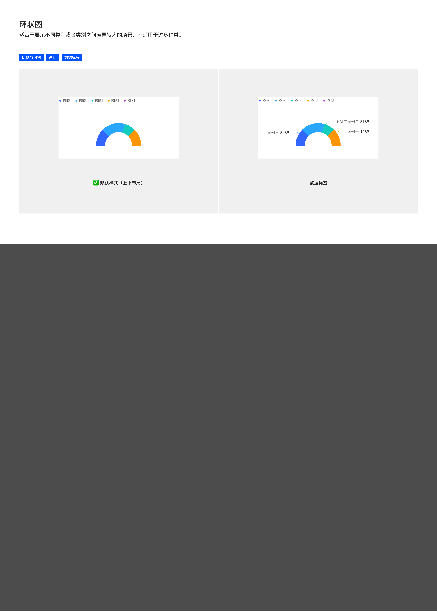

# 半环状图（Half-Donut Chart）

## Overview

半环状图是环状图的**上半部**形态——仅绘制 180°（半圆），适合在**垂直空间受限**的场景下展示占比。

适用场景：

- 比例与份额
- 占比
- 数据标签

> 形态像**仪表盘 / 进度计**，常用于「健康度评分」「资产达成率」「单一比率指示」等场景。

与同族图表的区别：

| 图表 | 区别 |
| --- | --- |
| 饼图 / 环图 | 360° 整圆 |
| 半环状图 | 仅 180° 上半圆 |

---

## 变体（Variants）

| 变体 | 说明 |
| --- | --- |
| **默认样式（上下布局）** | 图例在上，半环图在下 |
| **数据标签** | 在半环各扇区外侧标注「图例名 数值」（带引线） |

---

## 图形规范

PDF 仅展示变体与适用场景，未详述尺寸规范。规则**继承环状图**（详见 [donut.md — 图形规范](donut.md#图形规范shape-spec)），关键差异：

| 规则 | 半环状图 | 环状图 |
| --- | --- | --- |
| 角度范围 | **180°**（上半圆） | 360°（整圆） |
| 容器宽高比 | 接近 **2:1**（宽更大于高） | 1:1 |
| 中心文字 | 可在半环下方留白处（180° 半圆下方）填文字 | 在圆心 |

颜色、引线规则、数据标签、单选交互等均继承环状图。

---

## 数据标签

引线 / 颜色 / 字号规则**同环状图**（详见 [donut.md — 数据标签](donut.md#数据标签data-label)），半环图特有差异：

| 项 | 规则 |
| --- | --- |
| 数据标签位置 | **贴近半环底部**（180° 圆弧下沿）——沿弧线两端水平延伸；**不要飘在中心区** |
| 中心文字 | 数字 / 总值 / 状态文字放在半圆**内部下方**（180° 圆弧底缘以上），与数据标签位置区分清晰 |
| 引线 | 必有，跟随扇区颜色，起点距半环边缘 **+8px** |

---

## 交互状态

同环状图：

- **单选**：选中扇区保持，其余降到 20% 不透明度
- **悬停（PC & Web）**：hover 出 Tooltip，无点击态

详见 [donut.md — 交互状态](donut.md#交互状态interaction).

---

## 可配置项

继承环状图的可配置项（半径、环宽、数据标签），详见 [donut.md — 可配置项](donut.md#可配置项configurable).

---

## Tokens 引用清单

同 [donut.md — Tokens 引用清单](donut.md#tokens-引用清单).

---

## Examples

示意图包含：默认样式（上下布局）/ 数据标签变体。

---

## 实现要点（库无关）

- **仅绘制 180°**：只画上半圆，容器宽高比约 2:1。
- **规范继承环图**：半径、环宽、数据标签、引线、单选交互等均沿用环状图实现要点。
- **中心文字放下方留白区**：半圆下方的空白区放中心文字，不与半环重叠。

---

## Do & Don't

| | 规则 |
| --- | --- |
| ✅ | 仅绘制 180°（上半圆），容器宽高比接近 2:1 |
| ✅ | 其他规范完全继承环状图（半径、环宽、数据标签、引线、交互） |
| ✅ | 中心文字放在 180° 下方留白区（不与半圆重叠） |
| ❌ | 不要把半环展开到 270° 或其他奇怪角度——只用 180° |
| ❌ | 不要让半环垂直摆放（侧立）——失去仪表盘视觉隐喻 |
| ❌ | 不要在半环状图上叠加多组数据——一个半环对应一组比例 |

---

## 主题覆盖速查

本图表的颜色 / 字体 / 形态在业务线主题下可能被覆盖：

- **跨主题速查**：[themes/base.md § 被业务线主题覆盖项一览](../themes/base.md#被业务线主题覆盖项一览cross-theme-diff-map)
- **完整 delta 值**：[ifind.md](../themes/ifind.md)（iFinD-PC 静态图）/ [ainvest.md](../themes/ainvest.md)（含 Mobile / PC 分节）/ [ths.md](../themes/ths.md)（同时是 iFinD-Mobile 实现）

⚠️ 切了业务线主题画此图表时，**先**回上述主题文件确认本图表的颜色 / 字体 / 形态是否被覆盖；**未覆盖项**继承本文件 + base.md。色板维度**整套替换**不与 base 叠加（见 [SKILL.md § 维度叠加规则](../../SKILL.md#维度叠加规则)）。
