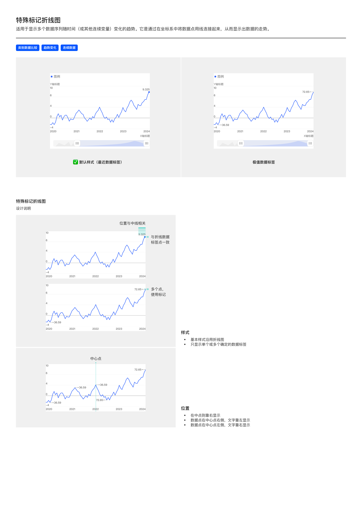

# 特殊标记折线图（Marker Line Chart）

## Overview

特殊标记折线图在基础折线图上**仅在确定位置**显示数据标签（如最近一期数据、极值点等），其余位置不显示标签，**减少视觉噪声**同时高亮关键数据点。

适用场景：

- 类别数据比较
- 趋势变化
- 连续数据

与同族折线图的区别：

| 图表 | 标签策略 |
| --- | --- |
| 基础折线图 | 默认全显（受数据量隐藏规则约束） |
| 多折线图 | 默认不显 |
| 区域高亮折线图 | 高亮区段两端显示 |
| 特殊标记折线图 | **仅在确定位置**（最近点 / 极值 / 中心点等）显示 |

---

## 变体（Variants）

| 变体 | 说明 |
| --- | --- |
| **默认样式（最近数据标签）** | 仅在最近一期数据点（折线最右端）显示标签 |
| **极值数据标签** | 在最高 + 最低值数据点显示标签 |

---

## 图形规范（Shape Spec）

### 样式

| 规则 | 说明 |
| --- | --- |
| 基本样式 | **沿用基础折线图**（线粗 1.5px / 数据点 6px / 颜色） |
| 标签策略 | 只显示**单个或多个确定**的数据标签 |

详见 [line.md — 图形规范](line.md#图形规范shape-spec).

---

## 标签位置规则（关键差异）

标签位置**与中线相关**——根据数据点在画布中央线的左 / 右位置自动决定标签对齐方向：

| 数据点位置 | 标签对齐 |
| --- | --- |
| 在中心点（正中） | **靠右显示** |
| 在中心点**右侧** | 数据点居右，**文字靠左显示**（文字向数据点左方延伸） |
| 在中心点**左侧** | 数据点居左，**文字靠右显示**（文字向数据点右方延伸） |

这是为了防止标签溢出画布边界，并保持视觉重心平衡。

---

## 颜色

标签颜色跟随折线色（单系列折线默认 `color-visualization-primary`），背景使用浅淡底色（如 `color-background-weak`）做胶囊。

---

## 交互状态

继承基础折线图的悬停 / 选中行为，详见 [line.md — 交互状态](line.md#交互状态interaction)。

---

## 可配置项

继承基础折线图的可配置项（线粗、数据点直径、数据标签样式），详见 [line.md — 可配置项](line.md#可配置项configurable)。

特有配置：**标签策略**（哪些点显示标签：最近 / 极值 / 自定义）。

---

## Tokens 引用清单

| Token | 用途 |
| --- | --- |
| `color-visualization-primary` | 折线色（默认） |
| `color-text-primary` | 数据标签文字 |
| `color-background-weak` | 数据标签胶囊背景 |
| `font-family-number` | 数据标签数字 |
| `size-line-stroke` | 线段描边 1.5px |
| `size-line-point` | 数据点 6px |

---

## Examples

整页示意图包含：默认样式（最近数据标签）vs 极值数据标签变体 / 标签位置规则（与中线相关，三种对齐方式）。

---

## 实现要点（库无关）

- **只算确定点的标签**：仅在最近点 / 极值点等确定位置计算并显示标签，不对全段数据求标签。
- **标签对齐随中线翻转**：标签对齐方向取决于数据点相对画布中线的位置——点在中线左侧文字靠右、点在右侧文字靠左，防止标签溢出画布。
- **位置算法需画布中线**：实现时需先知道画布水平中线坐标，再决定每个标签的对齐方向。
- **数据点描边色 + 光标 z**：沿用基础折线图——数据点描边跟随折线色（hover fill 切白，描边不变）；光标线在折线下方（z 特例）。详见 [line.md](line.md) 与 [base.md — 折线图 / 折柱组合特例](../themes/base.md#折线图--折柱组合特例重要)。

---

## Do & Don't

| | 规则 |
| --- | --- |
| ✅ | 基本样式完全沿用基础折线图 |
| ✅ | 仅在确定位置（最近 / 极值 / 自定义）显示标签 |
| ✅ | 标签对齐方向根据数据点相对画布中线的位置自动决定 |
| ✅ | 数据点在中线右侧时文字靠左，左侧时文字靠右 —— 防止标签溢出 |
| ❌ | 不要全段显示标签——那是基础折线图的行为 |
| ❌ | 不要让所有标签都固定一个方向（比如全部居右）——边界场景会溢出 |
| ❌ | 不要单独使用特殊标记折线图代替多折线对比场景 |

---

## 主题覆盖速查

本图表的颜色 / 字体 / 形态在业务线主题下可能被覆盖：

- **跨主题速查**：[themes/base.md § 被业务线主题覆盖项一览](../themes/base.md#被业务线主题覆盖项一览cross-theme-diff-map)
- **完整 delta 值**：[ifind.md](../themes/ifind.md)（iFinD-PC 静态图）/ [ainvest.md](../themes/ainvest.md)（含 Mobile / PC 分节）/ [ths.md](../themes/ths.md)（同时是 iFinD-Mobile 实现）

⚠️ 切了业务线主题画此图表时，**先**回上述主题文件确认本图表的颜色 / 字体 / 形态是否被覆盖；**未覆盖项**继承本文件 + base.md。色板维度**整套替换**不与 base 叠加（见 [SKILL.md § 维度叠加规则](../../SKILL.md#维度叠加规则)）。
