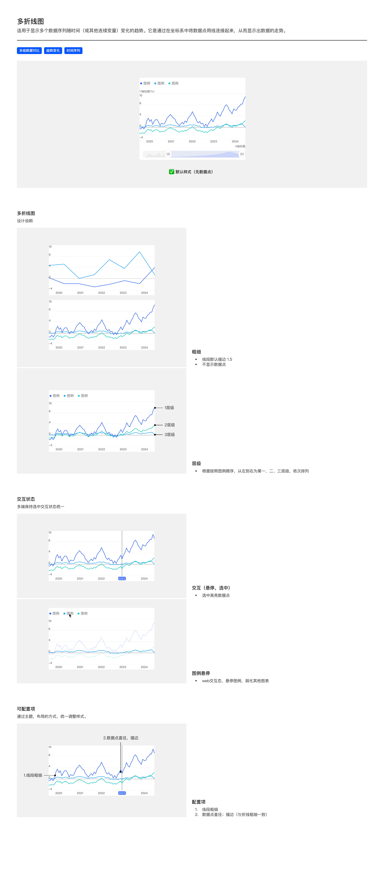

# 多折线图（Multi-Line Chart）

## Overview

多折线图用于显示**多个数据序列**随时间（或其他连续变量）变化的趋势——多条折线并列展示，便于对比走势差异。

适用场景：

- 多组数据对比
- 趋势变化
- 时间序列

与基础折线图的区别：基础折线图单条；多折线图 2+ 条，**默认不显示数据点**（点太多易碰撞）。

---

## 变体（Variants）

| 变体 | 说明 |
| --- | --- |
| **默认样式（无数据点）** | 多条折线并列；无数据点；无数据标签 |

PDF 仅列默认样式，但层级（视觉权重）按系列顺序划分（见下）。

---

## 图形规范（Shape Spec）

### 粗细

多折线图区分**主线**与**其他线**：

| 元素 | 值 | Token |
| --- | --- | --- |
| 主线（mainLine）描边 | **1.5px**（与单折线图一致） | `size-line-stroke` |
| 其他折线描边 | **1px** | `size-line-stroke-multi` |
| 数据点 | **不显示** | — |

> 多折线图里被指定为「主线」的那条用 1.5px（与基础折线图单线一致，视觉最突出），其余每条 1px——主线主次分明，其他线减细以减少互相干扰。未指定主线时，各条均可按 1px。
>
> 「主线」是折线图的通用概念：除线宽外，主线还可带渐变面积填充、选中态数据点放大等强调效果。

### 层级（Z-order，视觉权重）

> 本节「层级」专指**绘制的前后层叠（z-order）——谁压谁**，是一个维度（权威定义见 [base.md § Z-Index 层级](../themes/base.md#z-index-层级)）；下方 [§ 颜色](#颜色) 的「按系列序号取色」是另一个维度。两者**同序**（第 1 个系列既在最上层、又取色板第 1 色），但概念不同，勿把「层级」当配色用。

| 规则 | 说明 |
| --- | --- |
| 叠放顺序 | **按图例顺序，从左到右为第 1、2、3… 依次叠放** |
| 视觉权重 | 第 1 个系列在最上层（不被遮挡）；第 N 个系列最下层 |

### 颜色

各系列按**折线色板**顺序取色——**第 N 个系列（按图例顺序）取色板第 N 色**，详见 [tokens.md — 色板拆分](../tokens.md#可视化色板sequential-palette-核心)：

| 系列序号 | Token | 值 |
| --- | --- | --- |
| 第 1 个系列 | `color-visualization-primary` | `#3366FF` |
| 第 2 个系列 | `color-visualization-02` | `#FF9500` |
| 第 3 个系列 | `color-visualization-08` | `#CC41D9` |
| 第 4 个系列 | `color-visualization-04` | `#14CCBD` |
| 第 5 个系列 | `color-visualization-05` | `#199FFF` |
| 第 6 个系列 | `color-visualization-09` | `#858585` |

### 双 Y 轴启用条件

| 折线数量 | Y 轴数量 |
| --- | --- |
| 1 条 | 单轴（基础折线图） |
| 2+ 条同量纲 | 单轴 |
| 2+ 条**不同量纲** | **双轴**（左 + 右） |

详见 [坐标轴规范](../components/axes.md).

---

## 数据标签

**默认不显示**（多条折线时标签易堆叠）。若启用，按 [数据标签规范](../components/data-label.md) 规则。

---

## 交互状态（Interaction）

| 模式 | 说明 |
| --- | --- |
| **悬停 / 选中** | 选中点高亮显示数据点（即使默认无数据点，选中态也会显示点） |
| **图例悬停（Web 端）** | 悬停某条图例 → 该折线突出 + 其他折线弱化（不透明度降至 20%，见 legend.md） |

多端保持选中状态视觉统一。详见 [图例悬停规范](../components/legend.md#图例悬停web-端).

---

## 可配置项（Configurable）

| # | 配置项 | 说明 |
| --- | --- | --- |
| 1 | 线段粗细 | 默认 1.5px |
| 2 | 数据点直径 / 描边 | 描边与折线粗细一致 |

> 多折线图默认不显示数据点，相关配置项主要用于「选中态」时数据点的样式。

---

## Tokens 引用清单

| Token | 用途 |
| --- | --- |
| `color-visualization-primary` / `color-visualization-02` / `color-visualization-09` 等 | 系列色（顺序色板） |
| `font-family-number` | 轴数字 |
| `font-family-cn` | 中文图例 / 轴标题 |
| `size-line-stroke` | 主线（mainLine）描边 1.5px |
| `size-line-stroke-multi` | 其他折线描边 1px |
| `size-line-point` | 选中态数据点 6px |

---

## Examples

整页示意图包含：默认样式（无数据点）/ 粗细 / 层级（第 1/2/3 个系列依次叠放）/ 交互-悬停（选中高亮数据点）/ 图例悬停（弱化其他）/ 可配置项。

---

## 实现要点（库无关）

- **默认不显数据点**：多条折线时数据点易碰撞，默认隐藏。
- **层级按图例顺序**：第 1 个系列折线绘制在最上层、不被遮挡；按图例从左到右依次降低层级。
- **主线 1.5 / 其他线 1**：多折线图可指定一条「主线」用 1.5px（同单折线，最突出），其余线 1px——减少互相干扰；未指定主线时各条均按 1px。
- **不同量纲启用双轴**：2+ 条折线量纲不同时分左右两轴。
- **图例悬停联动**：Web 端悬停图例弱化其他折线。
- **数据点描边色跟随折线色**：默认隐藏数据点；hover / 选中态显示时，数据点 fill 切换白色，**描边色保持折线色不变**。详见 [line.md — 数据点描边](line.md#粗细)。
- **光标线在折线下方（z-index 特例）**：折线图中，axisPointer 的 z 必须低于折线 series——光标只是辅助指示，不应覆盖核心数据。详见 [base.md — 折线图 / 折柱组合特例](../themes/base.md#折线图--折柱组合特例重要)。

---

## Do & Don't

| | 规则 |
| --- | --- |
| ✅ | 默认不显示数据点（避免多线碰撞） |
| ✅ | 按图例顺序划分层级，第 1 个系列最上层 |
| ✅ | 多系列按顺序色板分配，第 N 条系列取第 N 色 |
| ✅ | 2+ 条不同量纲必须启用双 Y 轴 |
| ✅ | Web 端图例悬停时弱化其他折线 |
| ❌ | 不要在多折线图上默认显示数据点——会信息密度过高 |
| ❌ | 不要让两条折线使用相同颜色（即使在不同 Y 轴） |
| ❌ | 不要在单 Y 轴上混排量纲差异大的折线（如绝对值 vs 百分比） |
| ❌ | 不要硬编码层级 z-index，按图例顺序自动排列 |

---

## 主题覆盖速查

本图表的颜色 / 字体 / 形态在业务线主题下可能被覆盖：

- **跨主题速查**：[themes/base.md § 被业务线主题覆盖项一览](../themes/base.md#被业务线主题覆盖项一览cross-theme-diff-map)
- **完整 delta 值**：[ifind.md](../themes/ifind.md)（iFinD-PC 静态图）/ [ainvest.md](../themes/ainvest.md)（含 Mobile / PC 分节）/ [ths.md](../themes/ths.md)（同时是 iFinD-Mobile 实现）

⚠️ 切了业务线主题画此图表时，**先**回上述主题文件确认本图表的颜色 / 字体 / 形态是否被覆盖；**未覆盖项**继承本文件 + base.md。色板维度**整套替换**不与 base 叠加（见 [SKILL.md § 维度叠加规则](../../SKILL.md#维度叠加规则)）。
