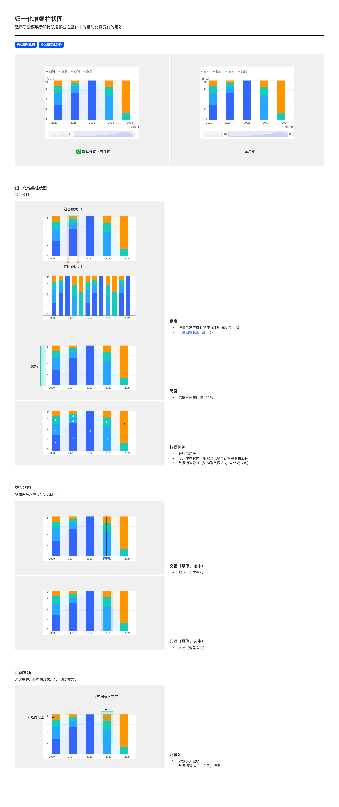

# 归一化堆叠柱状图（Normalized Stacked Bar Chart，百分比堆叠）

## Overview

归一化堆叠柱状图用于**展示和比较各部分在整体中的相对比例变化**。每根堆叠柱的总高被归一化到 **100%**，各分段表示该系列在当前类别下的占比。

适用场景：

- 构成相对比例（如各业务线占总营收的份额随年度变化）
- 多数据变化趋势（聚焦比例演变而非绝对值）

与普通堆叠柱状图的区别：堆叠柱图柱总高随数据绝对值变化；归一化堆叠柱图柱总高**永远是 100%**，只关心比例。

---

## 变体（Variants）

| 变体 | 说明 |
| --- | --- |
| **默认样式（有连接）** | 相邻柱之间相同系列的分段用淡色过渡带连接，便于追踪比例演变 |
| **无连接** | 相邻柱之间不绘制连接带，回退到独立堆叠 |

---

## 图形规范（Shape Spec）

### 宽度（Width）

| 规则 | 值 | Token |
| --- | --- | --- |
| 柱体最大宽度 | 32px（同基础柱状图） | `size-bar-max` |
| 单柱容器最大宽度 | **48px**（同基础柱状图） | `size-bar-container-max` |
| 柱距比 | 2:1 | `size-bar-bar-gap-ratio` |
| 连接色高密度隐藏 | **移动端数据 > 13 时**隐藏柱间连接过渡带 | — |

> 容器 48px 与基础 / 堆叠柱状图一致，不同于分组柱状图的 100px。

### 高度（Height）

| 规则 | 值 |
| --- | --- |
| 图表绘制区高度占用 | **100%**（柱总高始终撑满 Y 轴 0-100%） |
| 数据标签预留 | 由于柱顶就在 100% 位置，数据标签显示在段内而非柱顶 |

### 柱顶圆角

| 属性 | 值 | Token |
| --- | --- | --- |
| 所有分段 | **无圆角** | — |

### 颜色

按顺序色板分配各分段颜色。**连接过渡带**使用同系列色但透明度更低（约 40-60%），形成淡色 ribbon 效果。

---

## 数据标签（Data Label）

| 规则 | 说明 |
| --- | --- |
| **默认行为** | **不显示**（与基础 / 堆叠柱状图不同；默认隐藏避免过度信息密度） |
| 启用后位置 | 段内中心（不在柱顶——柱顶已在 100% 处） |
| 段内字色 | 根据分段背景对比度**自动换算黑 / 白** |
| 隐藏规则 | 移动端数据 > 5 隐藏；Web 端规则未定，按设计师配置 |

---

## 交互状态（Interaction）

| 模式 | 说明 |
| --- | --- |
| **十字光标**（默认） | 悬停 / 选中时垂直细线 + Tooltip 显示该柱所有分段占比 |
| **底色（容器宽度）** | 悬停 / 选中时整个柱容器宽度绘制半透明背景 |

多端保持选中状态视觉统一。

> 与堆叠柱状图相比，归一化堆叠的 PDF 未明确「图例悬停弱化」交互；按通用规则可按需启用，详见 [图例悬停规范](../components/legend.md#图例悬停web-端)。

---

## 可配置项（Configurable）

| # | 配置项 | 说明 |
| --- | --- | --- |
| 1 | 容器最大宽度 | 默认 48px |
| 2 | 数据标签样式 | 字号、行高 |

> 所有柱状图均无圆角，归一化堆叠柱状图同样遵循此规范。

---

## Tokens 引用清单

| Token | 用途 |
| --- | --- |
| `color-visualization-primary` / `color-visualization-02` / `color-visualization-09` 等 | 各分段系列色（顺序色板） |
| `color-text-primary` / `color-text-inverse-primary` | 段内数据标签颜色（自动对比） |
| `color-background-weak` | 选中态底色 |
| `font-family-number` | 数据标签 / 轴数字 |
| `font-family-cn` | 中文系列名 / 图例标签 |
| `size-bar-max` | 柱体最大宽 32px |
| `size-bar-container-max` | 单柱容器最大宽 48px |
| `size-bar-bar-gap-ratio` | 柱距比 2:1 |
| —（无圆角，不引用 `radius-bar-top`） | 所有分段无圆角 |

---

## Examples

整页示意图包含：默认样式（有连接）vs 无连接 / 宽度（含连接色隐藏规则）/ 高度 100% / 数据标签（默认不显示 / 段内对比度黑白）/ 交互-悬停 / 交互-选中 / 可配置项。

---

## 实现要点（库无关）

- **总高恒定 100%**：每根柱总高固定撑满，各段按占比换算高度——不要按绝对值绘制。
- **数据标签默认关闭**：归一化堆叠默认不显示数据标签避免信息过载；启用时段内文字对比度自适应。
- **柱间连接带高密度隐藏**：默认绘制相邻柱同系列的过渡连接带；数据量大（移动端 > 13）时隐藏，避免糊成一片。

---

## Do & Don't

| | 规则 |
| --- | --- |
| ✅ | 柱总高永远 100%，不随数据绝对值变化 |
| ✅ | 容器最大 48px（同基础柱状图，不是分组柱状图的 100px） |
| ✅ | 数据标签**默认不显示**；启用后段内文字按对比度自动黑 / 白 |
| ✅ | 默认绘制柱间连接过渡带；移动端数据 > 13 时隐藏 |
| ✅ | **所有分段无圆角**（与其他柱状图一致） |
| ❌ | 不要把归一化堆叠与普通堆叠混淆——前者总高 100% 固定，后者随绝对值变化 |
| ❌ | 不要默认开启数据标签——视觉密度会过高 |
| ❌ | 不要在高密度（移动端 > 13）下仍绘制连接带——会糊成一片 |
| ❌ | 不要给归一化堆叠柱加圆角——柱体应为直角 |

---

## 主题覆盖速查

本图表的颜色 / 字体 / 形态在业务线主题下可能被覆盖：

- **跨主题速查**：[themes/base.md § 被业务线主题覆盖项一览](../themes/base.md#被业务线主题覆盖项一览cross-theme-diff-map)
- **完整 delta 值**：[ifind.md](../themes/ifind.md)（iFinD-PC 静态图）/ [ainvest.md](../themes/ainvest.md)（含 Mobile / PC 分节）/ [ths.md](../themes/ths.md)（同时是 iFinD-Mobile 实现）

⚠️ 切了业务线主题画此图表时，**先**回上述主题文件确认本图表的颜色 / 字体 / 形态是否被覆盖；**未覆盖项**继承本文件 + base.md。色板维度**整套替换**不与 base 叠加（见 [SKILL.md § 维度叠加规则](../../SKILL.md#维度叠加规则)）。
