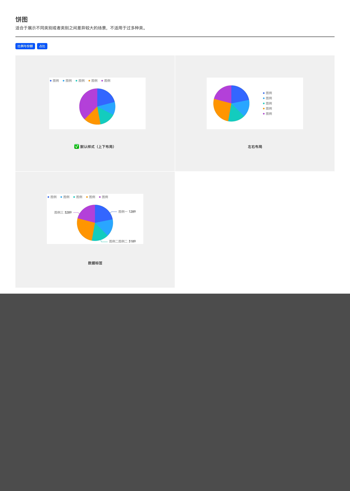

# 饼图（Pie Chart）

## Overview

饼图用于展示**不同类别或类别之间差异较大的场景**，以扇形面积表达占比。

适用场景：

- 比例与份额
- 占比

> **不适用**：过多种类（5 个以上扇区视觉会糊）。多类别场景请考虑环图、堆叠柱状图或归一化堆叠柱状图。

与同族图表的区别：

| 图表 | 区别 |
| --- | --- |
| 环图（Donut） | 中间挖空，可在中心填文字（如总额） |
| 半环状图 | 仅显示上半部，节省垂直空间 |

---

## 变体（Variants）

| 变体 | 说明 |
| --- | --- |
| **默认样式（上下布局）** | 图例在上，饼图在下 |
| **左右布局** | 图例在右，饼图在左 |
| **数据标签** | 在饼图各扇区旁标注「图例名 数值」（带引线） |

> PDF 提供的饼图规范较简化（无详细尺寸 / 容器 / 交互规则），更深的尺寸 / 交互规范请参考 [donut.md](donut.md)（环图，与饼图为同族结构）。

---

## 图形规范（Shape Spec）

### 颜色

各扇区按 [tokens.md — 可视化色板](../tokens.md) 的 `color-visualization-primary` / `color-visualization-01`~`-09` 依次取色。禁止引入色板外的颜色。

> **扇区之间无白色分割 / 边框**——直接由颜色区分扇区，相接处不画线条（不要 `borderWidth` 或 `border-color: white`）。

---

## 数据标签

| 规则 | 说明 |
| --- | --- |
| 显示形式 | 「图例名 数值」（如「图例三 3289」） |
| 引线 | 跟随饼图扇区颜色（**必有引导线**，不可省略） |
| 引线起点距饼图边缘 | **默认 +8px**（避免标签与饼图重叠） |
| 字号 / 字体 / 颜色 | 见 [数据标签规范](../components/data-label.md) |

---

## 交互状态（Interaction）

由于 PDF 未详述饼图交互，参考 [donut.md — 交互状态](donut.md#交互状态interaction)（饼图 = 环图无中心孔的特例）。

---

## 可配置项

| # | 配置项 | 说明 |
| --- | --- | --- |
| 1 | 图例布局 | 上下 / 左右 |
| 2 | 数据标签 | 是否显示，字号、颜色 |

更深规范请用 [donut.md — 可配置项](donut.md#可配置项configurable)。

---

## Tokens 引用清单

| Token | 用途 |
| --- | --- |
| `color-visualization-primary` / `color-visualization-02` / `color-visualization-09` 等 | 扇区色（顺序色板） |
| `font-family-number` | 数据标签数字 |
| `font-family-cn` | 中文图例名 |

---

## Examples

示意图包含：默认样式（上下布局）/ 左右布局 / 数据标签变体。

---

## 实现要点（库无关）

- **扇区按顺序色板分配**：每个扇区取色板中对应序号的颜色。
- **引线颜色跟随扇区**：数据标签引线的颜色与所属扇区一致。
- **类别数控制**：扇区超过 5 个时视觉拥挤，应改用环图、堆叠柱状图或归一化堆叠柱状图。
- **不支持负值**：饼图以面积表达占比，无法表达负值数据。

---

## Do & Don't

| | 规则 |
| --- | --- |
| ✅ | 扇区按顺序色板分配，第 N 个扇区取第 N 色 |
| ✅ | 数据标签的引线必须跟随扇区颜色 |
| ✅ | 类别数 ≤ 5 时使用饼图；多类别考虑环图或堆叠柱状图 |
| ❌ | 不要在饼图中心叠加文字——那是环图的功能 |
| ❌ | 不要硬编码扇区颜色 |
| ❌ | 不要用饼图展示**带负值**的数据（饼图无法表达负值） |
| ❌ | 不要用饼图做趋势对比——那是折线图的功能 |

---

## 主题覆盖速查

本图表的颜色 / 字体 / 形态在业务线主题下可能被覆盖：

- **跨主题速查**：[themes/base.md § 被业务线主题覆盖项一览](../themes/base.md#被业务线主题覆盖项一览cross-theme-diff-map)
- **完整 delta 值**：[ifind.md](../themes/ifind.md)（iFinD-PC 静态图）/ [ainvest.md](../themes/ainvest.md)（含 Mobile / PC 分节）/ [ths.md](../themes/ths.md)（同时是 iFinD-Mobile 实现）

⚠️ 切了业务线主题画此图表时，**先**回上述主题文件确认本图表的颜色 / 字体 / 形态是否被覆盖；**未覆盖项**继承本文件 + base.md。色板维度**整套替换**不与 base 叠加（见 [SKILL.md § 维度叠加规则](../../SKILL.md#维度叠加规则)）。
