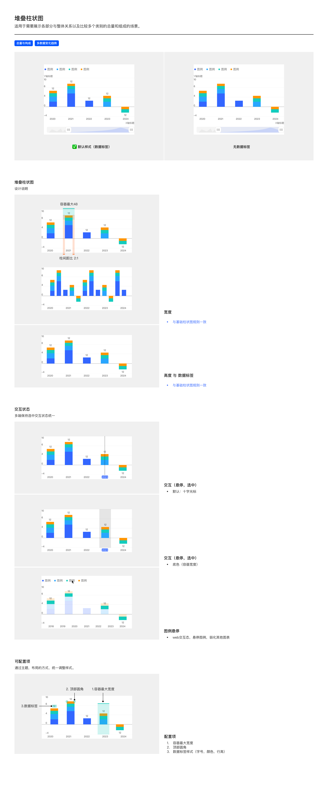

# 堆叠柱状图（Stacked Bar Chart）

## Overview

堆叠柱状图用于**展示各部分与整体的关系**以及**比较多个类别的总量和组成**。同一 X 位置一根柱内含多个分段，每段代表一个系列。

适用场景：

- 总量与构成（如各业务线对总营收的贡献）
- 多数据变化趋势（多个分量随时间的演变）

与同族图表的区别：

| 图表 | 区别 |
| --- | --- |
| 基础柱状图 | 单系列，无堆叠 |
| 分组柱状图 | 多系列并列，**不堆叠** |
| 归一化堆叠柱状图 | 堆叠柱总高按 100% 归一化，展示**比例**而非**绝对值** |

---

## 变体（Variants）

| 变体 | 说明 |
| --- | --- |
| **默认样式（带数据标签）** | 每段堆叠内显示分段数值 |
| **无数据标签** | 隐藏分段数值，仅由分段高度呈现 |

---

## 图形规范（Shape Spec）

### 宽度（Width）

**与基础柱状图规则一致**，详见 [bar.md — 宽度](bar.md#宽度width)。

| 规则 | 值 | Token |
| --- | --- | --- |
| 柱体最大宽度 | 32px | `size-bar-max` |
| 单柱容器最大宽度 | 48px | `size-bar-container-max` |
| 柱距比 | 2:1 | `size-bar-bar-gap-ratio` |

### 高度（Height）与数据标签

**与基础柱状图规则一致**，详见 [bar.md — 高度](bar.md#高度height)。

| 规则 | 值 |
| --- | --- |
| 图与数据标签最大占画布高度 | 95% |
| 数据为 0 | 1px 粗细占位 |
| 无数据 | 完全隐藏 |
| 含负值 | 负值段从 0 基线向下生长（详见 [bar.md — 负值规则](bar.md#高度height)） |

### 柱顶圆角

| 属性 | 值 | Token |
| --- | --- | --- |
| 所有分段 | 0px（无圆角） | `radius-bar-top` |

柱体及所有分段四角均为直角，不设圆角。

### 颜色

按顺序色板分配各分段颜色，详见 [tokens.md — 可视化色板](../tokens.md#可视化色板sequential-palette-核心)。同一系列在所有柱中颜色一致。

---

## 数据标签（Data Label）

| 规则 | 说明 |
| --- | --- |
| 显示位置 | 每段分段中心（PDF 默认样式显示「12」于各段内） |
| 字号 / 字体 / 颜色 | 见 [数据标签规范](../components/data-label.md) |
| 段内文字颜色 | 根据分段背景对比度自动换算黑 / 白 |
| 隐藏规则 | 移动端数据 > 5 隐藏；Web 端碰撞隐藏 |
| 总和标签 | 部分场景在柱顶显示总和（PDF 默认不显示） |

---

## 交互状态（Interaction）

| 模式 | 说明 |
| --- | --- |
| **十字光标**（默认） | 悬停 / 选中柱时，垂直细线 + Tooltip 显示该柱所有分段数值 |
| **底色（容器宽度）** | 悬停 / 选中时整个柱容器宽度绘制半透明背景 |
| **图例悬停（Web 端）** | 悬停某条图例时，该系列突出，其他分段弱化 |

多端保持选中状态视觉统一。

---

## 可配置项（Configurable）

| # | 配置项 | 说明 |
| --- | --- | --- |
| 1 | 容器最大宽度 | 默认 48px |
| 2 | 顶部圆角 | 默认 0px（无圆角） |
| 3 | 数据标签样式 | 字号、颜色、行高 |

---

## Tokens 引用清单

| Token | 用途 |
| --- | --- |
| `color-visualization-primary` / `color-visualization-02` / `color-visualization-09` 等 | 各分段系列色（按顺序色板） |
| `color-text-primary` / `color-text-inverse-primary` | 段内数据标签颜色（自动对比） |
| `color-background-weak` | 选中态底色 |
| `font-family-number` | 数据标签 / 轴数字 |
| `font-family-cn` | 中文系列名 / 图例标签 |
| `size-bar-max` | 柱体最大宽 32px |
| `size-bar-container-max` | 单柱容器最大宽 48px |
| `size-bar-bar-gap-ratio` | 柱距比 2:1 |
| `radius-bar-top` | 柱顶圆角 0px |

---

## Examples

整页示意图包含：默认样式（带数据标签）vs 无数据标签 / 宽度（同基础柱状图）/ 高度与数据标签（同基础柱状图）/ 交互-悬停 / 交互-选中 / 图例悬停 / 可配置项。

---

## 实现要点（库无关）

- **柱体不设圆角**：所有分段四角均为直角。
- **段内标签对比度自适应**：数据标签显示在段内时，文字颜色按所在段背景亮度自动取黑或白。
- **极小段兜底**：堆叠中数值极小的段设最小高度兜底避免消失；但 0 值仍按 0 值规则处理。
- **系列色跨柱一致**：同一系列在所有堆叠柱中颜色一致。

---

## Do & Don't

| | 规则 |
| --- | --- |
| ✅ | 宽度、高度规则与基础柱状图完全一致（容器 48 / 柱距比 2:1 / 95% 高度占比） |
| ✅ | 所有分段四角直角，不设圆角 |
| ✅ | 段内数据标签颜色根据背景对比度自动黑 / 白 |
| ✅ | 多系列按顺序色板分配，同一系列在所有柱中颜色一致 |
| ✅ | Web 端图例悬停弱化其他分段 |
| ❌ | 不要给堆叠柱加圆角——所有分段应为直角 |
| ❌ | 不要让段内标签写死黑色或白色——必须按对比度自动换算 |
| ❌ | 不要把堆叠柱状图与分组柱状图混用：前者是**堆叠**累加，后者是**并列**对比 |
| ❌ | 不要在堆叠柱顶显示总和数值而段内也显示分量——会信息冗余 |

---

## 主题覆盖速查

本图表的颜色 / 字体 / 形态在业务线主题下可能被覆盖：

- **跨主题速查**：[themes/base.md § 被业务线主题覆盖项一览](../themes/base.md#被业务线主题覆盖项一览cross-theme-diff-map)
- **完整 delta 值**：[ifind.md](../themes/ifind.md)（iFinD-PC 静态图）/ [ainvest.md](../themes/ainvest.md)（含 Mobile / PC 分节）/ [ths.md](../themes/ths.md)（同时是 iFinD-Mobile 实现）

⚠️ 切了业务线主题画此图表时，**先**回上述主题文件确认本图表的颜色 / 字体 / 形态是否被覆盖；**未覆盖项**继承本文件 + base.md。色板维度**整套替换**不与 base 叠加（见 [SKILL.md § 维度叠加规则](../../SKILL.md#维度叠加规则)）。
