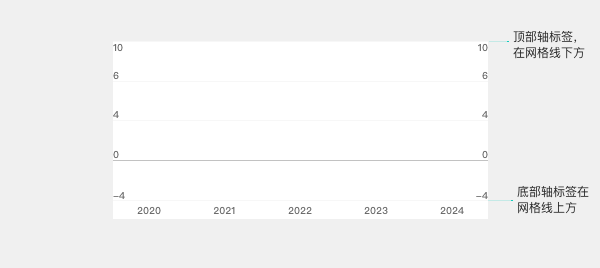
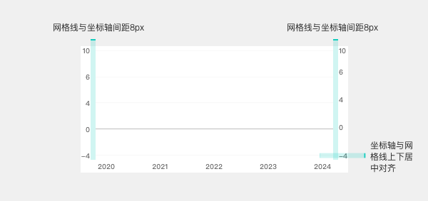

# 整体布局（Layout）

> 📌 **常用值已在 [themes/base.md（base 主题）](../themes/base.md) 内联**——画 base 主题图表时直接从那里取值。本文件是详细规范，仅在需要边界细节（动画分档、交互态、多端差异、配置选项等）时查阅。用了业务线主题（iFinD-PC / Ainvest / THS）请同时查 [themes/](../themes/) 下对应 delta 文件。

图表的整体尺寸、区域结构、多端差异。

---

## 尺寸与结构

| 属性 | 值 | Token |
| --- | --- | --- |
| 图表整体宽度 | 343px（标准移动端） | `size-chart-width` |
| 区域布局 | flex-col（图例 / 图表区 / 滑块） | — |
| 三区域垂直间距 | 8px | `spacing-chart-region-gap` |
| 图表绘制区高度 | 160px | `size-chart-region-height` |

> 设计 PDF 用占比（95% / 5%）表达高度，未给绝对值；160px 为 paradigm-chart 代码侧 grid 实证高度。

结构：

```
[ 图例区域           ]   ← 始终显示
[ 图表绘制区          ]   ← 160px 高
[ 范围滑块           ]   ← 仅"看板=on"时显示，24px 高
```

主副图结构（K 线主图 + MACD 副图等）见 [main-sub.md](../main-sub.md)。

---

## Y 轴标签布局

Y 轴标签有两种布局形式，**默认使用形式 A**：

### 形式 A：坐标轴在网格内部 + 标签避让网格线（默认）



- Y 轴标签**渲染在 grid 绘图区内部**（不进入 grid 外的 padding 圈），且**绝不探出 grid 上 / 下边缘**
- 每个标签坐落在其对应网格线「朝 grid 内部」的一侧——**顶线标签往下挂、其余线标签往上顶**：
  - **顶部轴标签**（轴最大值，落在最顶网格线）：grid 内部在其**下方** → 标签**顶边贴线、整体向下垂进第一格**（顶对齐）
  - **其余轴标签**（中间值 / 0 值 / 最小值）：grid 内部在其**上方** → 标签**底边贴线、整体向上探入上一格**（底对齐）
  - 因此每个标签始终位于其对应网格线的**单侧**（顶标签在线下、其余在线上），与网格线**永不重叠**；没有标签骑线居中、也没有标签探出 grid
- **验收判据（渲染后逐条核对，与实现库无关）**：① 最顶标签上边缘 y ≥ grid 上沿 y（**不溢出顶部** —— 最常见错误）；② 最顶标签整体落在第一格内（在顶线下方）；③ 最底 / 0 标签下边缘 ≤ grid 下沿 y（不溢出底部）
- **落地提示**：顶标签与其余标签的垂直对齐方向**相反**——若实现库的轴标签垂直对齐是「全局一刀切」（如 ECharts `axisLabel.verticalAlign`），单一取值必有一端溢出，需 per-label 处理；ECharts 落地见 [echarts-implementation-hints.md § 陷阱 21](../echarts-implementation-hints.md)
- **数据绘制范围左右内缩（避让带）**：Y 轴标签住在 grid 内，数据图形不能从 grid 边缘起画——在**有 Y 轴标签的每一侧**预留一条竖直「避让带」，数据绘制区从 grid 内边缘再向内缩掉这条带：
  - **带宽 W** = 该侧最长 Y 轴标签的渲染宽度 + 安全间距
  - **带起点 = grid 边缘**（紧贴内侧）；所有数据图元（柱 / 折线 / 散点 / 面）的横向范围限制在缩进后的区域内，起点贴带末端，与标签**水平分离、永不重叠**
  - 单 Y 轴：仅有标签的一侧内缩；双 Y 轴：两侧均内缩；形式 B 不内缩（标签在 grid 外侧）
  - **验收判据（渲染后必须为真，与实现库无关）**：任意 Y 轴标签的包围盒，与任意数据图元的包围盒，**不相交**
- **适用图表族**：

  | 适用 | 图表 |
  | --- | --- |
  | ✅ 柱状（category X） | bar / grouped-bar / stacked-bar / normalized-stacked-bar / waterfall / bar-line-combo |
  | ✅ 折线（category X） | line / multi-line / area-highlight / marker-line / rank-line / marker |
  | ❌ 不适用 | horizontal-bar（Y=category，本规则与之无关）/ 无 grid 类（pie / donut / half-donut / petal / radar / treemap / sankey / relationship / two-way-tree / venn / word-cloud） |
- **落地实现**：按上述「带宽 = 标签宽 + 安全间距」不变量在目标库中实现（数据 scale range 内缩 / domain padding / 绘制起点偏移等，各库手段不一）；ECharts 的具体落地（value/time 轴、category 轴需首尾补空类目）见 [echarts-implementation-hints.md § 陷阱 19](../echarts-implementation-hints.md)

### 形式 B：坐标轴在网格外部 + 标签与网格线居中对齐



- 坐标轴位于网格**外部**（左右两侧）
- 标签与网格线**上下居中对齐**
- 网格线与坐标轴间距：**8px**

---

## 0 值与无数据的视觉规则

| 情况 | 柱状图 | 折线图 |
| --- | --- | --- |
| 数值 = 0 | 显示 1px 粗细的柱条占位 | 节点正常显示在 0 位置 |
| 无数据 / null | 完全隐藏该位置柱条 | 折线断开，不连接前后点 |
| 数据标签 | 0 值：显示「0」　/ 无数据：不显示 | 同左 |

---

## 字体规则（硬约束）

- **所有数值用 `font-family-number`**（THS Money font）
- 数值单位（万 / 亿 / %）用 **font-family-number Bold**
- 中文系列名 / 标题 / 单位说明用 `font-family-cn`
- 数字与中文混排，数字部分单独节点包裹
- 禁止硬编码字体名

---

## 动画（Animation）

### 入场动画（柱状图）

柱状图入场动画时长**按绘制区高度分档**——图越高，动画越长，保持视觉节奏一致：

| 绘制区高度 | 动画时长 | 缓动 |
| --- | --- | --- |
| 0 – 80px | 320ms | `cubicOut` |
| 80 – 160px | 480ms | `cubicOut` |

### 折线图动画 / 性能

| 项 | 规则 |
| --- | --- |
| 主线选中放大 | 主线数据点在悬停 / 选中态放大 **1.2 倍** |
| 高密度采样 | 数据量大时启用降采样算法，避免渲染卡顿（不影响视觉趋势） |

### 通用

- 交互态（Tooltip / 光标）**无过渡动画**，紧跟鼠标
- 缓动统一用 `cubicOut`（先快后慢，自然减速）

---

## 水印（Watermark）

通用结构 / 加载机制 / 锚定基准 / 资源协议见 [components/watermark.md](watermark.md)。各主题具体 logo / 透明度 / 锚定见 [themes/](../themes/) 各主题文件 § 水印。

---

## 多端差异（Mobile / PC）速查

> 📐 术语对照（PC = Web = 桌面端、移动端 = Mobile 等）见 [SKILL.md § 术语约定](../../SKILL.md#术语约定glossary)。各组件文件中「Web 1px」「PC 12px」等写法均按该表指桌面端。

本规范的尺寸 / 字号默认以**移动端**为基准。具体差异分散在各组件文件中，速查索引如下：

| 项             | 文件                 | 说明                         |
| ------------- | ------------------ | -------------------------- |
| 轴标签 / 轴标题字号 | [axes.md](axes.md) | 字号 10 → 12px（颜色多端一致） |
| 网格线 / 0 轴线宽   | [grid.md](grid.md) | 移动 0.5px → Web 1px         |

> 各 chart 文档与 [tokens.md](../tokens.md) 中标注的字号值（如「轴标签 10px」）默认指移动端，其余规范（颜色 / 圆角 / 交互逻辑）多端一致。

---

## Token 映射汇总（共享元素）

| 元素分类 | Token 字号 | Token 字重 | Token 颜色 |
| --- | --- | --- | --- |
| A：图例 / 分页 | `font-size-extra-small` | 配置 | `color-text-secondary` |
| B：轴标题 / 数据标签 | `font-size-xxs` | `font-weight-medium` | `color-text-secondary` |
| C：轴标签 | `font-size-xxs` | 配置 | `color-text-secondary` |
| D：高亮标签轴 | `font-size-xxs` | `font-weight-bold` | `color-text-inverse` |
| D：高亮标签轴背景 | — | — | `color-visualization-highlight-background-tick` |
