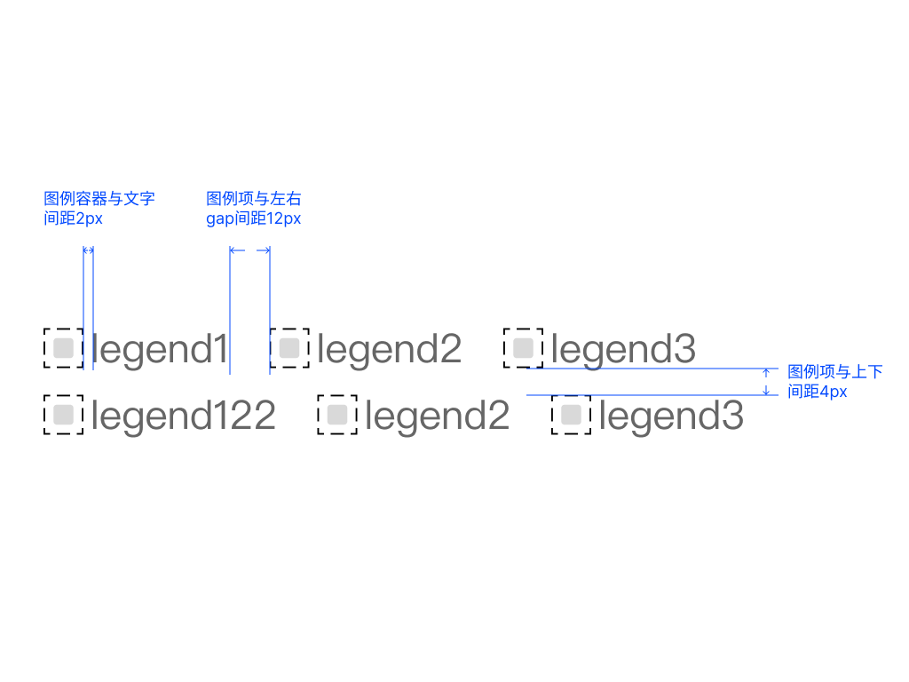
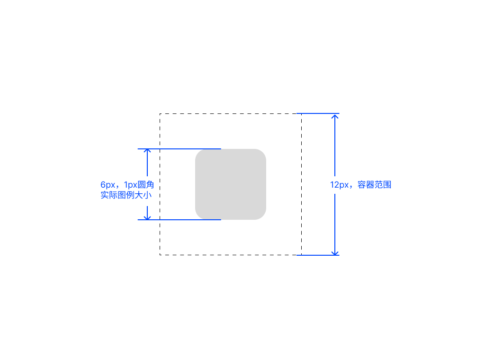
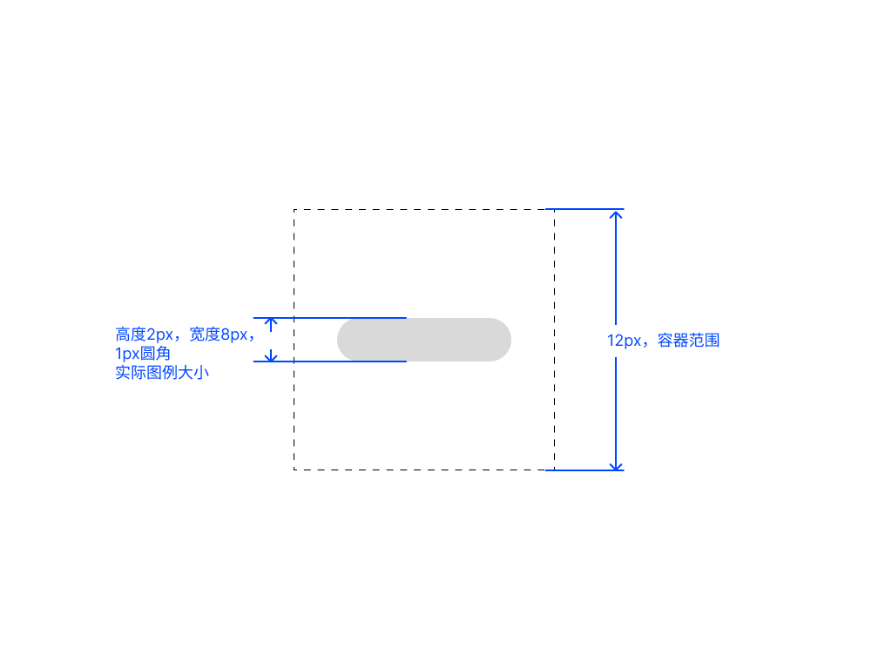
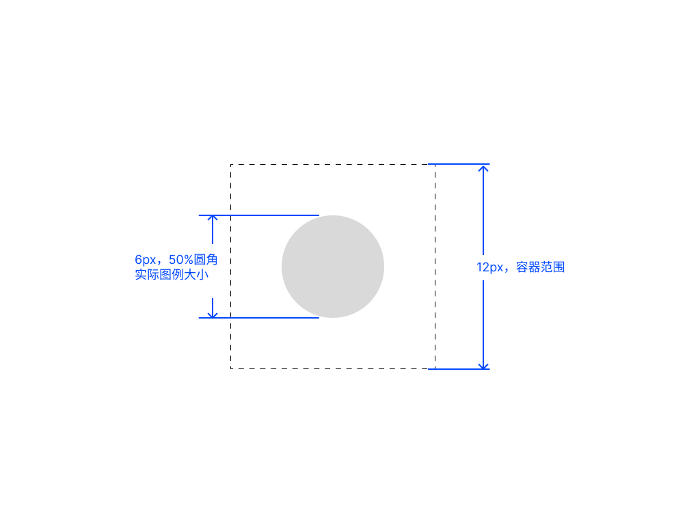
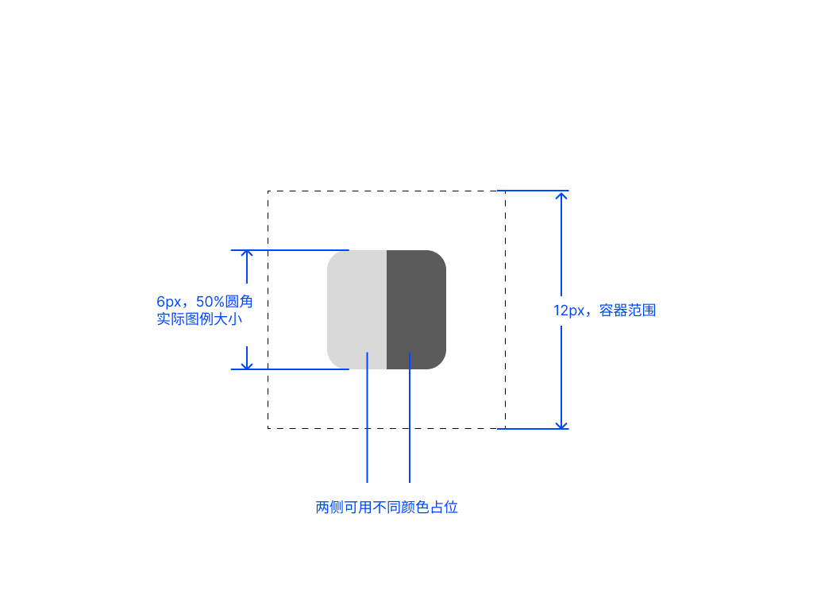
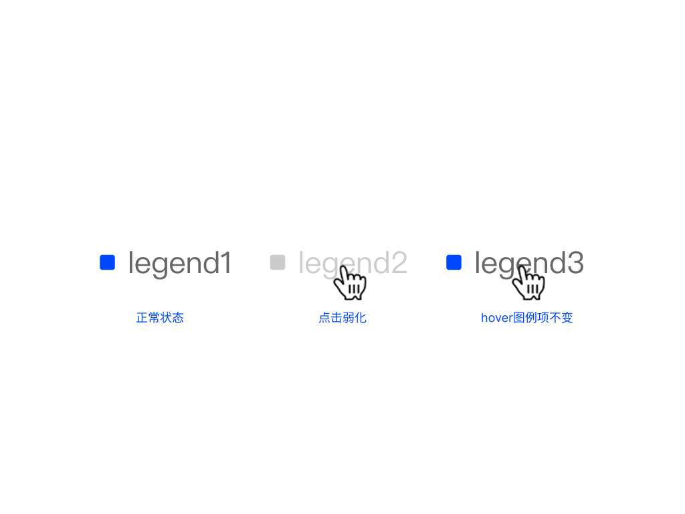

# 图例（Legend）

> 📌 **常用值已在 [themes/base.md（base 主题）](../themes/base.md) 内联**——画 base 主题图表时直接从那里取值。本文件是详细规范，仅在需要边界细节（动画分档、交互态、多端差异、配置选项等）时查阅。用了业务线主题（iFinD-PC / Ainvest / THS）请同时查 [themes/](../themes/) 下对应 delta 文件。

图例区域位于图表顶部，显示系列名称和颜色标记，支持交互（点击显隐 / 悬停高亮）。

---

## 容器规范

| 属性 | 值 | Token |
| --- | --- | --- |
| **默认对齐** | **左对齐**（图例从容器左侧开始排列） | — |
| 图例项水平间距 | 12px | `spacing-legend-item-h` |
| 图例换行行间距 | 4px | `spacing-legend-row-v` |

---

## 图例项（每项 = 图例标记 + 图例标签）

| 元素 | 规格 | Token |
| --- | --- | --- |
| 标记容器（点击热区） | 12×12px | `size-legend-marker` |
| 标记本体（容器内可见图形） | **6×6px**（柱/饼/雷达/散点） / **8×2px**（折线短横线胶囊，1px 圆角） | `size-legend-mark-body` |
| 标记与标签间距 | 2px | `spacing-legend-marker-label` |
| 标签字号 | 12px / 16px 行高 | `font-size-extra-small` / `line-height-small` |
| 标签字体 | `font-family-cn` Regular（系统无衬线链） | `font-family-cn`, `font-weight-regular` |
| 标签颜色 | `rgba(0,0,0,0.6)` | `color-text-secondary` |

**图例项结构示意**（marker 容器 / 本体 / 与标签间距 / 项左右间距 / 换行上下间距）：

---

## 图例标记形状（按图表类型）

> **图例标记颜色默认跟随对应系列的图表色**（柱条、折线、扇区等），通过 `currentColor` 继承，确保图例与图形视觉一致。Tooltip 中的图例标记同步遵循此规则，详见 [tooltip.md](tooltip.md)。

| 图表类型 | 形状 | 标记尺寸（宽×高） | 颜色处理 |
| --- | --- | --- | --- |
| 柱状 / 条形 | 居中小方块（1px 圆角） | **6×6px** | `currentColor` 跟随系列色 |
| 折线 | 居中水平短线（1px 圆角） | **8×2px** | `currentColor` 跟随系列色 |
| 饼 / 环图 / 气泡 / 雷达 | 圆点 | **6×6px** | `currentColor` 跟随系列色 |
| 虚线 | 两段短线并排模拟虚线 | 8×2px | `currentColor` 跟随系列色 |
| 蜡烛 | 缩略蜡烛（左阳右阴） | 12×12px | 固定涨跌色 |
| 红绿柱 | 左右双色分割小块 | 12×6px | 固定涨跌色 |
| 其他 | 无归类，默认使用居中小方块（1px 圆角） | 6×6px | `currentColor` 跟随系列色 |

**图例标记形态示意**（虚线框为 12×12 容器热区，灰色为实际可见图形）：

| 类型 | 示意 |
| --- | --- |
| 矩形（柱 / 条形） |  |
| 胶囊（折线） |  |
| 圆点（饼 / 环 / 雷达 / 散点） |  |
| 红绿柱（双色拼接） |  |

> ⚠️ **折线标记的宽度（8px）大于柱状标记（6px）**——不要统一成同一个尺寸，否则折线标记会缩成一个点看不出线形。

**混合图表的图例标记**：折柱组合图等混合类型，每个系列的图例标记**独立跟随自身图表类型**——柱系列用方块、折线系列用短线，不统一成一种形状。

> 业务线（Ainvest / iFinD 等）可指定一种全局图例样式（如 Ainvest 全用圆形）；新增图例样式需评估通用性（覆盖率 > 80%）才纳入规范。特殊图例（异形 / 纹理）属高定样式，不纳入规范。图例 SVG 与图表色板一致。

---

## 排列规则

> ⚠️ **单系列图表也必须显示图例**——即使只有一条系列（如基础柱状图、基础折线图），也要显示图例，让用户知道数据含义。仅当图表本身完全无系列名义可言时（极少见）才省略。

- **默认左对齐**，单行横向排列
- 单行宽度装不下时**自动换行（flex-wrap）**，由容器宽度决定，不按固定项数分档
- 超出多行可承载范围时走分页 / 滑动逻辑，见「图例溢出」

---

## 图例溢出

「图例溢出」是「自动换行」之上的**补充逻辑**：当无法预知图例项数量、换行后**超过 2 行**仍装不下时，进入溢出态。

| 端 | 默认行为 | 备选 |
| --- | --- | --- |
| 移动端 | **滑动显示更多** | 继续换行 |
| Web / PC | **分页器**（如 `1/3` + 翻页箭头） | 支持换行 |

切换组件（横向布局 / 纵向布局）支持显示更多图例。

> ⚠️ **图例区域占位优先，绘图区让位**——图例换行或分页后高度增加，绘图区相应缩小；**不允许图例与绘图区重叠**（包括图例文字超出后压在数据线/柱上）。换行 / 分页器是默认行为，不能关闭。

---

## 图例交互

**多选（反选）模式**：

| 触发 | 效果 |
| --- | --- |
| hover 某条图例 | 该图例对应的图表图形（柱 / 线 / 扇区等）保持原色；**其他系列的图表图形不透明度降至 20%**；图例本身（文字 / marker）不变化 |
| 点击某条图例 | 该图例文字与 marker 切换为 `color-text-quaternary`（24%）；对应图表系列隐藏（不显示） |

> 弱化 = 文字 / marker 用 `color-text-quaternary`；隐藏 = 对应图表不显示。

**图例交互三态示意**（正常 / hover 弱化 / 点击隐藏）：

**单选模式**：

| 触发 | 效果 |
| --- | --- |
| 点击某条图例 | 弱化非选中图例 + 隐藏非选中对应图表 |
| 点击其他图例 | 切换选择 |
| 点击同图例（已选中） | 恢复初始状态 |

---

## 图例悬停（Web 端）

多系列图表（分组柱状图、堆叠柱状图、归一化堆叠柱状图、多折线图、折柱组合图等）的 Web 端交互态：

| 行为 | 触发 | 效果 |
| --- | --- | --- |
| **悬停某条图例** | 鼠标悬停于图例项 | 该系列突出（正常显示），其他系列**不透明度降至 20%**（与上方 § 图例交互 一致） |
| 离开图例 | 鼠标移出 | 所有系列恢复正常透明度 |
| 点击图例 | 单击图例项 | 切换该系列显示 / 隐藏（折线 / 柱条整条隐藏） |

| 适用 | 不适用 |
| --- | --- |
| 分组柱状图、堆叠柱状图、归一化堆叠柱状图 | 单系列基础柱状图（无意义） |
| 多折线图、折线图 2+ 条 | 折线图单条（无意义） |
| 折柱组合图（图例含柱和折线两类） | K 线图（无图例悬停态） |

> 移动端通常无悬停态，图例的交互通过点击「显示 / 隐藏」实现，没有悬停弱化效果。

---

## 分页器（Web/PC 默认）

| 元素 | 规格 | Token |
| --- | --- | --- |
| 文字（如 `1/3`） | 字号、颜色、行高 | `font-family-cn` |
| 图标 | 12×12px（SVG 替换） | — |
| 间距统一 | 默认 4px | — |

---

## 右侧下拉（可选）

图例区域右端可配置一个下拉选项（文字 + 下箭头图标，12px `font-family-cn` `font-weight-regular`，`color-text-primary`），用于切换指标或周期。
