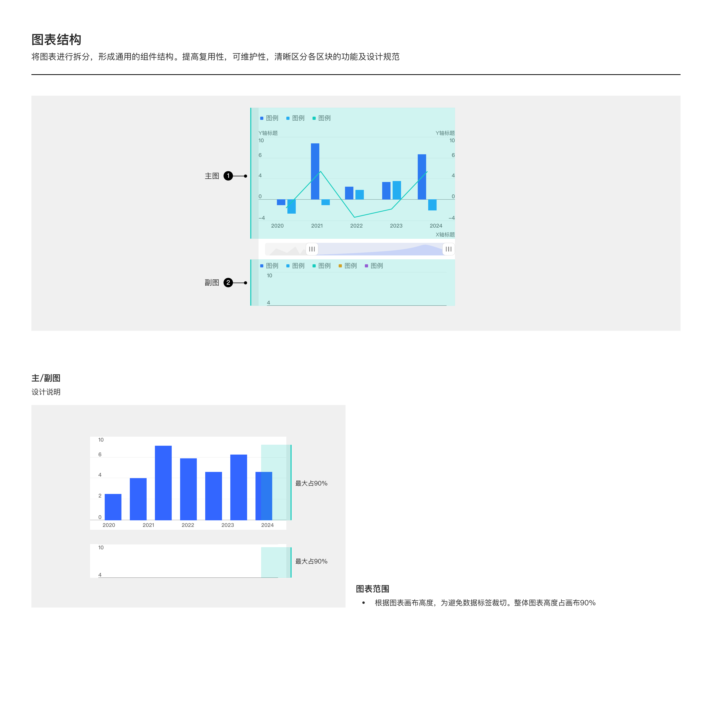

# 主副图结构（Main / Sub Chart Structure）

## Overview

「主副图」**不是一种具体图表**，而是一种**图表结构概念**——把一份完整的图表布局拆分为「主图（1）」+「副图（2）」两个独立绘制区，**共享 X 轴和范围滑块**，但 Y 轴独立、内容独立。

典型应用：

- **K 线图主图 + 成交量 / MACD / KDJ 副图**（金融最常见）
- 价格主图 + 涨跌幅副图
- 销量主图 + 转化率副图（与折柱组合图的区别：主副图是**上下两个独立绘制区**；折柱组合图是**同一绘制区内**柱 + 折线）

把图表拆分为通用组件结构能提高复用性 / 可维护性，并清晰区分各区块的功能与设计规范。

---

## 图表结构

```
┌─────────────────────────────────────┐
│  图例区域                              │
├─────────────────────────────────────┤
│                                     │
│  主图（1）                             │  ← 独立绘制区，含主 Y 轴 + 副 Y 轴
│                                     │
├─────────────────────────────────────┤
│  范围滑块（共享 X 轴）                   │
├─────────────────────────────────────┤
│                                     │
│  副图（2）                             │  ← 独立绘制区，独立 Y 轴
│                                     │
└─────────────────────────────────────┘
```

主图和副图共享同一个 X 轴时间维度；范围滑块同时驱动两者。

---

## 图表范围（Height Rule）

| 规则 | 值 |
| --- | --- |
| **主图整体高度** | 最大占画布高度的 **90%**（顶部 / 底部留 10% 预留数据标签喘息） |
| **副图整体高度** | 最大占画布高度的 **90%**（与主图独立计算） |

> 这里的「90%」与基础柱状图的「95%」不同——主副图各自有独立绘制区，预留更多空间避免数据标签裁切。

---

## 主图（Main Chart）

主图承载核心数据图形。常见类型：

| 类型 | 用例 |
| --- | --- |
| K 线图 | 金融行情 |
| 折柱组合 | 销量柱 + 增长率折线 |
| 多折线 | 多指标对比 |

主图支持**双 Y 轴**（左 + 右）。

---

## 副图（Sub Chart）

副图承载辅助指标。常见类型：

| 类型 | 用例 |
| --- | --- |
| 红绿柱（成交量） | 金融成交量 |
| MACD / KDJ | 金融技术指标 |
| 单折线 | 比率 / 衍生指标 |

副图通常只有单 Y 轴。

---

## 范围滑块（共享）

主副图共享同一个范围滑块（datazoom），拖动滑块时**主图和副图的 X 轴同时缩放**。

范围滑块规范详见 [数据缩放轴规范](components/datazoom.md)。

---

## 与其他多图概念的区别

| 概念 | 结构 | 共享 X 轴 |
| --- | --- | --- |
| **主副图** | 上下两个独立绘制区 | 是 |
| 折柱组合图 | 同一绘制区，柱 + 折线 | 自然共享 |
| 多 panel 仪表盘 | 多个完全独立图表 | 否（各自独立） |

主副图是「上下分割结构」，组件组合是「同区叠加」。

---

## Examples



示意图包含：主图 + 副图的整体结构 / 主图独立绘制区 + 双 Y 轴 / 副图独立绘制区 / 共享范围滑块 / 主副图各自占画布 90% 高度。

---

## 实现要点（库无关）

- **共享 X 轴**：主图与副图共用同一条 X 轴时间维度，X 轴缩放 / 平移联动两者。
- **独立绘制区与 Y 轴**：主图、副图各自独立的绘制区和 Y 轴；主图可双 Y 轴，副图通常单 Y 轴。
- **高度分配**：主图、副图各自占画布最大 90%；副图高度不超过主图。
- **范围滑块统一驱动**：一个范围滑块同时控制主图和副图。

---

## Do & Don't

| | 规则 |
| --- | --- |
| ✅ | 主图和副图各自占画布最大 90% 高度 |
| ✅ | 主副图共享 X 轴和范围滑块 |
| ✅ | 主图可双 Y 轴；副图通常单 Y 轴 |
| ✅ | 主副图用 8px 间距分隔（同 [layout.md](components/layout.md) 整体布局） |
| ❌ | 不要让主副图各自有独立的 X 轴——共享 X 才能联动 |
| ❌ | 不要让范围滑块只控制主图不控制副图 |
| ❌ | 不要把主副图混用为折柱组合图——前者上下分割，后者同区叠加 |
| ❌ | 不要让副图高度超过主图——副图是辅助 |

---

## 主题覆盖速查

本图表的颜色 / 字体 / 形态在业务线主题下可能被覆盖：

- **跨主题速查**：[themes/base.md § 被业务线主题覆盖项一览](themes/base.md#被业务线主题覆盖项一览cross-theme-diff-map)
- **完整 delta 值**：[ifind.md](themes/ifind.md)（iFinD-PC 静态图）/ [ainvest.md](themes/ainvest.md)（含 Mobile / PC 分节）/ [ths.md](themes/ths.md)（同时是 iFinD-Mobile 实现）

⚠️ 切了业务线主题画此图表时，**先**回上述主题文件确认本图表的颜色 / 字体 / 形态是否被覆盖；**未覆盖项**继承本文件 + base.md。色板维度**整套替换**不与 base 叠加（见 [SKILL.md § 维度叠加规则](../SKILL.md#维度叠加规则)）。
