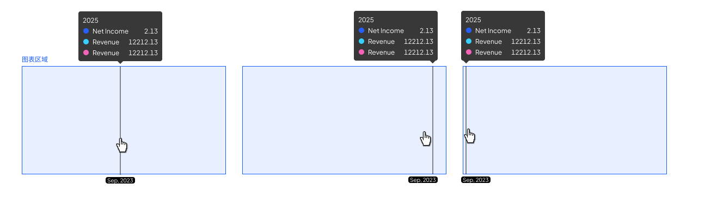

# Ainvest 主题（Theme: Ainvest）

> ⚠️ **本文件差异源自 paradigm-chart 代码**（`src/theme/ainvest/` 与 `ainvest-pc/`），**尚无独立权威设计 PDF**——所有覆盖值标「待设计确认」。设计师补 Ainvest 设计稿后逐条核对。
>
> 📐 **本文件只记录 Ainvest 相对 [base 主题](base.md) 的「差异（delta）」**。未在此列出的项一律**继承 base 主题**（[tokens.md](../tokens.md) / [components/](../components/) / [charts/](../charts/)）。
>
> 用法：先按 base 主题查到值，再回此处看有无覆盖；有则**以 Ainvest 值为准**。
>
> 📐 **本文件按端分节**：第一节"共享 delta"在 Ainvest-Mobile 与 Ainvest-PC 均生效；第二节为 Ainvest-Mobile 端专有；第三节为 Ainvest-PC 端专有。**当前 PC 端 delta 大部分未在 doc 中明示**——除非有明确证据，否则按"二、Mobile 专有"取值时不建议直接套用到 PC；Ainvest-PC 项目落地前需补完第三节。

---

## 主题元信息

| 项 | 值 |
| --- | --- |
| 主题名 | Ainvest（海外业务线） |
| 代码对应 | mobile：`ainvest-app-light` / `ainvest-app-dark`（`src/theme/ainvest/`）<br>PC：`ainvest-pc-light` / `ainvest-pc-dark`（`src/theme/ainvest-pc/`） |
| 继承基准 | base 主题（[../tokens.md](../tokens.md) / [../components/](../components/) / [../charts/](../charts/)） |
| 色彩模式 | light / dark 均支持（沿用 tokens.md 浅/深双列写法） |
| 端 | mobile + PC（按下方分节查阅；色板 / 字体等业务线身份项端通用） |
| 覆盖优先级 | base → 本文件 delta → 图表级 → 实例级（最高）（详见 [SKILL § 覆盖优先级](../../SKILL.md#覆盖优先级)） |
| **继承不变项** | z-index 层级顺序（`ainvest` 直接引用 `mobile/static/z`）、0 值/无数据规则、颜色 token 引用规则等全局规则 |

> Ainvest 是「海外」业务线，最核心的差异是 **① 换色板 ② 不使用同花顺品牌字体（改用 `font-family-en` token）**，其余为间距 / 线宽 / 组件形态的细节调整。
>
> **端拆分约定**：色板 / 字体 / 涨跌色 / 折线线宽 / 桑基配色 / Legend marker 形状 / **Tooltip 形态** / **绘制区高度（端通用 200px）** / 进度条柱状图 / **水印 logo** / **datazoom** / **Legend 项间距** / **柱状（barGap / 标签色等）** 等属于**业务线身份级**——mobile 与 PC 共享，归入第一节。坐标轴标签字号-行高-颜色 / Y 轴布局形式 等属于**端专属**——分入第二、三节。

---

## 一、共享 delta（mobile + PC 均生效）

### 1.1 序列色板 — ⚠️ Ainvest 主题色板（整套独立，不与 base 叠加）

> 色板维度不走 delta 继承——本节是 **Ainvest 主题**的完整色板，使用时整套替换 base 的色板序列。详见 [SKILL.md § 主题维度叠加规则](../../SKILL.md#维度叠加规则)。

Ainvest 8 色色板，**独立硬编码**，不取自 `color-visualization-*` token（对照 base 6 色折线色板）：

| 序号  | base 主题              | Ainvest 覆盖    |
| --- | ------------------ | ------------- |
| 1   | `#3366FF`（primary） | **`#265FFC`** |
| 2   | `#FF9500`（02）      | **`#38D1FF`** |
| 3   | `#CC41D9`（08）      | **`#F564B9`** |
| 4   | `#14CCBD`（04）      | **`#733ED6`** |
| 5   | `#199FFF`（05）      | **`#00DDCB`** |
| 6   | `#858585`（09）      | **`#273D8F`** |
| 7   | —（base 仅 6 色）     | **`#FF7040`** |
| 8   | —                  | **`#9EA9C7`** |

单系列默认色 = `#265FFC`（对应 base primary `#3366FF`）。

### 1.2 折柱组合图色板 — ⚠️ 独立子序列（柱 / 折线分两套，避免同色）

折柱组合图**不**按 [§ 1.1](#11-序列色板--ainvest-主题色板整套独立不与-base-叠加) 的顺序整体取色，而是从 8 色色板中拆出两套独立子序列：柱与折线各走一套，**禁止交叉**。对照 base 主题（折线走 02/09、柱走 primary/04/05/06/07/08），Ainvest 同样遵循"折线走色板末段、柱走色板前段"的拆分思路。

**折线色板**（按出现顺序取色，最多 2 根）：

| 序号 | 颜色 | 对应 §1.1 |
| --- | --- | --- |
| 1 | **`#FF7040`** | 第 7 色 |
| 2 | **`#9EA9C7`** | 第 8 色 |

**柱状色板**（按系列序号取色，最多 6 色）：

| 序号 | 颜色 | 对应 §1.1 |
| --- | --- | --- |
| 1 | **`#265FFC`** | 第 1 色 |
| 2 | **`#38D1FF`** | 第 2 色 |
| 3 | **`#F564B9`** | 第 3 色 |
| 4 | **`#733ED6`** | 第 4 色 |
| 5 | **`#00DDCB`** | 第 5 色 |
| 6 | **`#273D8F`** | 第 6 色 |

> **规则**：折线第 1 色固定 `#FF7040`，第 2 色固定 `#9EA9C7`；柱按 `#265FFC → #38D1FF → #F564B9 → #733ED6 → #00DDCB → #273D8F` 顺序取色。**禁止柱与折线交叉使用对方序列**，以避免柱 / 线撞色。

### 1.3 字体 — ⚠️ 海外不使用同花顺品牌字体

| Token / 场景 | base 主题 | Ainvest 覆盖 |
| --- | --- | --- |
| 数值字体（轴 / 标签 / Tooltip 数值） | `font-family-number`（THSJinRongTi） | **`font-family-en`**（Plus Jakarta Sans 链） |
| 中文 / 系列名 | `font-family-cn`（系统无衬线链） | **`font-family-en`** |

> 含义：Ainvest 全图统一引用 `font-family-en` token（底层 Plus Jakarta Sans → 系统无衬线 fallback 链），**不引用 THS Money font / 中文品牌字体**。字号 / 字重沿用 base（10/12 等，axisLabel 500）。

### 1.4 折线 / 数据点 — 线宽统一加粗

| 场景 | base 主题 | Ainvest 覆盖 |
| --- | --- | --- |
| 折线线宽 | 单线 1.5 / 多线主线 1.5 / 其他 1（`size-line-stroke` / `-multi`） | **统一 2px**（不分主/次） |
| 数据点描边宽 | 1.5px（`size-line-point` 6px 含 1.5 描边） | **2px**（点径 6 不变） |
| 主线面积渐变 | 主线（`id:'mainLine'`）渐变填充，色 `#3366FF` | 同机制，**渐变色随新色板 `#265FFC`** |
| 数据点直径 / 隐藏策略 | 6px / >5 隐藏（移动端） | 6px / >13 隐藏（`dvShowSymbolStrategy:13`） |

> **数据点两态**（与 base 一致，Ainvest 仅描边宽由 1.5px 改为 2px）：
>
> | 状态 | fill | border |
> | --- | --- | --- |
> | **默认态** | **= 折线色**（实心圆，⚠️ **不是白色**） | 2px 折线色 |
> | **hover 态** | 切白（light `#fff` / dark `#171717`） | 保持折线色不变 |
>
> ⚠️ 白 fill **仅在 hover** —— 不要把 hover 的白色搬到默认态。
>
> ⚠️ **默认态 itemStyle 会经继承链污染 legend marker**：fill 白 → legend 空心圆；borderWidth 2px → legend 撑大到 12×12。两个症状同源，根因与修法（含 `legend.itemStyle.borderWidth: 0` 显式 override）见 [echarts-implementation-hints.md 陷阱 8 / 陷阱 20](../echarts-implementation-hints.md)。

### 1.5 Legend / Tooltip marker 形状 + Legend 字号

| 项 | base 主题 | Ainvest 覆盖 |
| --- | --- | --- |
| Legend marker 形状 | 按 seriesType 区分（柱→6×6 方块、折线→8×2 胶囊、饼/雷达→6×6 圆点） | **统一圆形 10×10**（不按 seriesType 区分） |
| Legend marker 容器（点击热区） | 12×12 | **12×12**（同） |
| Legend marker → text 间距（`spacing-legend-marker-label`） | 2px | **6px** |
| Tooltip marker 形状 | 与 legend 一致（按 seriesType） | **统一圆形 10×10**（与 legend 同步） |
| **Legend 文字字号** | 12px | **12px**（同 base，显式确认） |
| **Legend 文字行高** | —（未指定） | **16px**（端通用） |

> ⚠️ 主题切换时 tooltip marker 必须与 legend 同步——`formatter` 里不能直接拼 `params.marker`（ECharts 默认固定圆点尺寸 / 形状不可控）。修法见 [echarts-implementation-hints.md 陷阱 15](../echarts-implementation-hints.md)。
>
> ⚠️ **本表声明的 10×10 圆形是设计期望值——ECharts 默认渲染会撑大到 12×12**：折线 series 的 `itemStyle.borderWidth: 2` 通过继承链让 legend 圆描边外溢、视觉直径加 2。必须在 `legend.itemStyle.borderWidth: 0` 显式 override 才能落实本表的 10×10。详见 [echarts-implementation-hints.md 陷阱 20](../echarts-implementation-hints.md)。

### 1.6 Tooltip 形态（端通用 / 仅折线柱状）

> 📌 **形态 = [tooltip.md 位置 B（上方跟随指针）](../components/tooltip.md#位置-b-定位算法库无关)**——下三角 + 锚 grid 上沿 + 边缘 clamp + 三角反向偏移的**库无关 4 步算法 / 不变量 / 禁忌 / 自检清单统一在 tooltip.md 维护**，本节只记 Ainvest 的 delta 取值 + 适用白名单，不重复算法。
>
> ⚠️ 只改 `backgroundColor` + `hideDelay` **不算实现**；必须按 tooltip.md 位置 B 的 4 步算法落地。ECharts 完整 `position` 回调代码、反例与 5 条易错点见 [echarts-implementation-hints.md § 陷阱 18](../echarts-implementation-hints.md)。

#### 适用范围（哪些图启用位置 B）

| 适用 | 图表类型 | 结构前提 |
| --- | --- | --- |
| ✅ 折线图族 | line / multi-line / area-highlight / marker-line / rank-line / marker | 有 grid + X category/time 轴 |
| ✅ 柱状图族 | bar / grouped-bar / stacked-bar / normalized-stacked-bar / bar-line-combo / waterfall | 同上 |
| ❌ 不适用（回退位置 A） | pie / donut / half-donut / petal / radar / scatter / beeswarm / treemap / sankey / relationship / two-way-tree / venn / word-cloud；**横向条形图（horizontal-bar）** | 无 grid 或无 category X 轴，定位依据失效。**横向条形图特例**：category 在 **Y 轴**、数值在 X 轴，不满足 B 的"X category 轴 + grid 上方留白"前提，回退 A（与 [horizontal-bar.md](../charts/horizontal-bar.md) 自述"跟随鼠标"一致） |

> 原因：位置 B 依赖**横向 X 轴 + grid 上方留白带**两个结构前提；缺一即回退 **位置 A**（base 默认跟随鼠标右下，见 [tooltip.md § Tooltip 显示位置](../components/tooltip.md#tooltip-显示位置)）。

#### Ainvest delta 取值（相对 base）

| 项 | base 主题 | Ainvest 覆盖 |
| --- | --- | --- |
| 位置形态 | 位置 A（跟随鼠标右下） | **位置 B（上方跟随指针 + 下三角；算法见 [tooltip.md](../components/tooltip.md#位置-b-定位算法库无关)）** |
| 背景 | `#3B3B3B`（`color-visualization-tooltip`） | **`#383838`** |
| 下三角指示器 | 无 | **有，`#383838` 同色，高 6px**（即算法中 `tooltipTop = gridTopY − th − 6` 的 6） |
| 移出延迟隐藏 | 2000ms（`hideDelay`） | **0ms**（立即隐藏；`axisPointer.dvHideDelay` 0） |
| 触发 / 过渡 | `trigger:'axis'` / `transitionDuration:0` | 同 |
| 圆角 | 4px | 4px（同） |

> 📐 位置与边缘处理示意：
> 
> 左：光标在左侧，Tooltip 居中显示；中：光标偏右，Tooltip 仍居中；右：光标贴近右边缘，气泡贴边、三角偏移指向光标线。

### 1.7 涨跌色 / 桑基图节点配色

**涨跌色 — ⚠️ 海外「绿涨红跌」（与 base / A 股语义反转）：**

| Token | base 主题 | Ainvest 覆盖 |
| --- | --- | --- |
| `color-price-up`（上涨） | `#FF2436`（红） | **`#00B53C`**（绿） |
| `color-price-down`（下跌） | `#07AB4B`（绿） | **`#FF381A`**（红） |

> ⚠️ **语义反转**：base / A 股是「红涨绿跌」，Ainvest 海外是「绿涨红跌」——涨 / 跌方向不变，只是映射到的颜色对调。`color-price-even`（平盘）未覆盖，继承 base。仍遵守 [SKILL § 全局规则 3](../../SKILL.md#3-颜色按用途使用对应-token-category)：涨跌只用 `color-price-*`，不得复用 status 色。

**桑基图节点配色**（汇节点直接复用上面的涨跌色）：

| 节点类型 | base 主题 | Ainvest 覆盖 |
| --- | --- | --- |
| 源节点 + 中间节点 | `color-visualization-primary`（`#3366FF`） | **`#265FFC`** |
| 汇节点（正值） | `color-price-up` | **`#00B53C`**（= 涨色绿） |
| 汇节点（负值 / 支出） | `color-price-down` | **`#FF381A`**（= 跌色红） |

> 业务线身份级配色——mobile 与 PC 共享。

### 1.8 高亮标签胶囊 — 颜色（端通用）

| 项 | base 主题 | Ainvest 覆盖 |
| --- | --- | --- |
| 背景色（light） | 蓝（`color-visualization-highlight-background-tick`） | **`#000000`** |
| 标签颜色（light） | 白（`color-text-inverse`） | **`#FFFFFF`** |
| 背景色（dark） | — | **`#FFFFFF`** |
| 标签颜色（dark） | — | **`#000000`** |
| 圆角 | 2px（`radius-axis-label-tag`） | **4px** |

> 字号端不同：胶囊**字号跟随当前端的坐标轴标签字号**（mobile 10、PC 14 等），不单独设定。

### 1.9 进度条柱状图（Progress Bar）— ⚠️ Ainvest 独有

base 主题**无**此系列；Ainvest 独有的横向进度条类型（业务线级，端通用）：

- 柱宽固定 18px（`barMaxWidth=barMinWidth=18`）；可选背景槽 `showBackground`。
- 支持「顶部标签 series」：读 `yAxis.data` 在每条进度条上方渲染分类标签（字号 14 / 字重 400）。
- 标签默认隐藏，开背景时右侧标签最大宽 60、超出截断。

> 实际 PC 版可能在样式上微调，待 ainvest-pc/ 代码核对。

### 1.10 水印（端通用）

> 通用结构 / 加载机制 / 锚定基准 / 资源协议 / 反例见 [components/watermark.md](../components/watermark.md)。本节仅记 Ainvest 主题相对 base 的 delta。

**资源文件**：

| 模式 | 路径 |
| --- | --- |
| Light | [`assets/examples/_shared/ainvest-watermark-light.svg`](../../assets/examples/_shared/ainvest-watermark-light.svg) |
| Dark  | [`assets/examples/_shared/ainvest-watermark-dark.svg`](../../assets/examples/_shared/ainvest-watermark-dark.svg) |

**delta 表**：

| 项 | base | Ainvest |
| --- | --- | --- |
| Logo | base 水印 SVG | **Ainvest SVG**（见上方资源） |
| 尺寸 | — | **96 × 20**（SVG viewBox 内已写死） |
| 透明度 (light) | 极浅灰 | **5% 黑**（SVG 内 `fill-opacity="0.05"`） |
| 透明度 (dark) | — | **20% 白**（SVG dark 内已设） |
| 锚定 | grid 右下角，距 grid 右侧 36px | **grid 左下角** |
| 端 | — | Mobile + PC 共用同一份资源 / 同一位置 |

**预览**：

| Light | Dark |
| --- | --- |
|  |  |

### 1.11 绘制区高度 — ⚠️ 端通用 200px

| 项 | base 主题 | Ainvest 覆盖（端通用） |
| --- | --- | --- |
| 图表绘制区高度 | 160px（`size-chart-region-height`） | **200px**（PC 与 Mobile 均覆盖，整套替换不分端） |

> Ainvest 设计要求图表绘制区端通用 200px——**PC 不再继承 base 的 160**，与 Mobile 保持一致。代码侧用 `size-chart-region-height` token 在 Ainvest 主题下整体覆盖为 200。
>
> ⚠️ **常见误读防御**：base 主题 § 整体布局表里写的「绘制区高度 160px」是 base 的 mobile 默认值；Ainvest 主题下**该值被整体替换为 200**，不分端——不要按"base PC 推断 → Ainvest PC 仍是 160"来取值。
>
> 水印纵向锚点（`graphic.bottom`）也要随之配 `grid.bottom + 内边距`，否则水印掉到 X 轴标签区。见 [components/watermark.md § 锚定基准](../components/watermark.md)。

### 1.12 瀑布图柱样式 — ⚠️ Ainvest 独有箭头柱形

> 📌 **本节是 Ainvest 在瀑布图上的整体形态重写**——不仅覆盖配色，连柱体内部结构（箭头线 + 端线）都不同于 base。属于业务线身份级，端通用。
>
> ⚠️ **来源**：产品口述（2026-06 设计沟通），**待 Ainvest 设计师 PDF 复核确认所有数值**——下表标的 primary 20% / 2px 描边 / 箭头线宽等均为草案。

#### 形态总览

| 项 | base 瀑布（[waterfall.md](../charts/waterfall.md)） | Ainvest 瀑布 |
| --- | --- | --- |
| **正向 / 负向柱填充** | 涨色（`color-price-up`）/ 跌色（`color-price-down`）fill 全长 | **统一 `color-visualization-primary` 20% 不透明度**（`rgba(38, 95, 252, 0.2)`）—— 正负柱**同色**浅底 |
| **正向柱方向标记** | 无 | **向上箭头线**（primary 20%）从柱底垂直向上指向柱顶；**柱底 2px primary 描边线**作为"生长基点" |
| **负向柱方向标记** | 无 | **向下箭头线**（primary 20%）从柱顶垂直向下指向柱底；**柱顶 2px primary 描边线**作为"收缩基点" |
| **total 柱**（期初 / 期末） | base 主色 fill | 保留 primary 实心 fill（与增减柱浅底 + 箭头形态视觉区分；⚠️ 待 PDF 确认） |
| 柱顶圆角 | 0px | 0px（继承） |
| 最大柱宽 | 64px（瀑布图覆盖基础柱 32px） | 64px（继承） |

#### 设计意图（为什么换形态）

| 维度 | base 叙事 | Ainvest 叙事 |
| --- | --- | --- |
| 增减判断依据 | fill 颜色（涨色 = 增、跌色 = 减）—— **事后定性** | 形态方向（上箭头 + 底线 = 自下而上生长；下箭头 + 顶线 = 自上而下减少）—— **前置成形态本身** |
| fill 的语义 | 承担"增 / 减"的颜色编码 | 剥离出"是否增减"语义，只承担"这一根的占位"职能（统一浅底） |
| 涨跌色绑定 | 强绑定 A 股涨跌色（红涨绿跌） | 不绑定——海外业务线不强加 A 股语义 |

#### 副作用与边界（必须显式声明）

1. **不能跨主题套用**：切回 base / iFinD / THS 画瀑布时，必须**回退**为 fill 涨跌色 + 无箭头形态。Ainvest 形态是该主题独占。
2. **fill 同色潜在歧义**：正负柱底都是 primary 20%，**单纯看 fill 区分不出增减**——必须靠箭头方向 + 端线位置。任何场景下都**不能省略箭头 / 端线**（一旦省略 = 信息丢失）。
3. **数值标签仍由柱顶 label 承担**（继承 [waterfall.md § Y 轴 / 网格线](../charts/waterfall.md#y-轴--网格线--覆盖基础规则) —— Y 网格线 + Y 标签都关闭、柱顶必显数值）。

#### ECharts 实现要点

ECharts 原生 `series.type: 'bar'` **不支持柱内嵌套箭头线 + 端线** —— 必须复合实现：

```
方案 A（推荐）：主柱 + 叠加 custom series
- series[0]: bar 类型，画 primary 20% 浅底矩形（fill 全长）
- series[1]: custom 类型，每根柱内部 renderItem 绘制三件套：
    · 箭头线（垂直线 + 三角箭头头部）
    · 起点端线（2px 横线，positive 在柱底 / negative 在柱顶）

方案 B（不推荐）：纯 custom series 全自绘
- 自绘 fill 矩形 + 箭头 + 端线 —— 控制最严，但失去 ECharts bar 内置 stack 能力，瀑布的"透明垫柱"语义实现复杂
```

> 本节为业务线身份级形态，**端通用**（mobile + PC 共享）。

### 1.13 范围滑块（datazoom）

| 项 | base 主题 | Ainvest 覆盖 |
| --- | --- | --- |
| 轨道高度 | `24px`（`size-slider-height`） | **4px**（细轨） |
| 选中填充 | `#3366FF` 8%（`color-visualization-datazoom-filler`） | **`rgba(0,0,0,.6)` 浅 / `rgba(255,255,255,.6)` 深**（深灰，非蓝） |
| 把手尺寸 | 24×24px | **32×32px** |
| 把手圆角 | 6px（`radius-slider-handle`） | **50%**（全圆） |
| 把手内 grip 线 | 8×1.5px，间距 2.5px | **10×1.5px，间距 3px** |
| 把手对齐 | 中心点对齐（把手中心与轨道中心对齐） | **边缘对齐**（把手左右两端与轨道左右端对齐） |
| 未选中区域数据 | 显示底部数据形状 | **不显示**（把手左右两侧无数据阴影） |
| 数据阴影 | 显示底部数据形状 | **`showDataShadow:false`**（不显示） |
| 布局间距 | 把手高度 ≤ 轨道高度，不溢出 | 把手 32px 远大于轨道 4px，**X 轴与 datazoom 之间须留足间距**，确保把手不与轴标签重叠 |

### 1.14 Legend 项左右间距

| 项 | base 主题 | Ainvest 覆盖 |
| --- | --- | --- |
| Legend 项左右间距（`itemGap`） | 12px | **16px** |
| Legend 项上下间距（换行时两行之间） | 4px | **4px**（同） |

> marker 形状 / 间距相关共享项见 [§ 1.5](#15-legend--tooltip-marker-形状--legend-字号)。

### 1.15 柱状图

| 项 | base 主题 | Ainvest 覆盖 |
| --- | --- | --- |
| 柱间距比 | 2:1（`size-bar-bar-gap-ratio`，`barGap≈50%`） | **`barGap: '5%'`**（柱挨得更近） |
| 单柱最大宽 | 32px（`size-bar-max`） | 32px（同） |
| 多柱组内单柱宽 | 由容器/间距公式推 | **`66 / 组内柱数`** |
| 柱标签色 | 继承系列色（`inherit`） | **固定二级灰** `rgba(0,0,0,.6)` 浅 |
| 柱顶圆角 | 0px（无圆角） | **0px（无圆角）** |
| 高亮态 | 去除 echarts 高亮提亮（`emphasis.disabled`） | 同 |

---

## 二、Ainvest-Mobile 专有 delta

> 📐 本节为 **Ainvest-Mobile 端专属** delta（PC 端的坐标轴 delta 见 [§ 三、Ainvest-PC 专有 delta](#三ainvest-pc-专有-delta)）。端通用的业务线身份级项见上方 [§ 一、共享 delta](#一共享-deltamobile--pc-均生效)。

### 2.1 绘制区 / 网格

> 📐 主图绘制区高度 **200px** 已端通用，移至 [§ 1.11](#111-绘制区高度--端通用-200px)。本节仅保留 mobile 端专有的副图 grid 细节。

| 项 | base 主题 | Ainvest-Mobile 覆盖 |
| --- | --- | --- |
| 副图 grid 高度（主副图布局，如 K 线 + MACD） | —（base 未列） | **100px** |

### 2.2 坐标轴

| 项 | base 主题 | Ainvest-Mobile 覆盖 |
| --- | --- | --- |
| 主值（Y）轴位置 | 左侧（feedback #9） | **右侧**（`position: 'right'`；第 2 根及以后才落左侧）—— **端通用：PC 同（见 [§ 3.1](#31-坐标轴)）** |
| Y 轴标签 | 网格内部 | 内部（同），`verticalAlign: 'bottom'` |
| Y 轴标签字号 | 10px（移动端） | **10px**（同 base） |
| Y 轴标签行高 | —（未指定） | **12px** |
| Y 轴标签颜色 | `color-text-secondary` | **`color-text-secondary`**（同 base） |
| X 轴轴线 | 默认不显示 | **显示**，`#808080` 浅 / `#666666` 深，宽 0.5 |
| Y 轴网格线颜色 | `#000` 6%（`color-visualization-divider`） | **`#000` 10% 浅 / `#fff` 10% 深** |
| 分割线条数 | 5 条 | 5 条（同，`splitNumber`=5） |

> Tooltip 形态属于**端通用共享 delta**，已移至 [§ 1.6](#16-tooltip-形态端通用--仅折线柱状)。

### 2.3 饼图（差异未完整核对，登记存在差异）

Ainvest 有独立 `series/pie.ts`（内径 48 / 外径 80、点击高亮其余弱化、引导线 length 16+length2 6 ≈ 距饼图 32）。与 base 饼图规范的差异待逐项核对，**当前暂以 base 饼图规范为准**。

---

## 三、Ainvest-PC 专有 delta

### 3.1 坐标轴

| 项 | base 主题 | Ainvest-PC 覆盖 |
| --- | --- | --- |
| 主值（Y）轴位置 | 左侧 | **右侧**（端通用，与 Mobile 一致；第 2 根及以后才落左侧） |
| Y 轴标签布局形式 | **形式 A**（轴在网格内部 + 标签避让网格线） | **形式 B**（轴在网格外部 + 标签与网格线居中对齐；轴与网格线间距 8px） |
| Y 轴标签字号 | 12px（PC） | **11px** |
| Y 轴标签行高 | —（未指定） | **16px** |
| Y 轴标签颜色 | `color-text-secondary` | **`color-text-primary`** |

> 形式 B 完整定义见 [components/layout.md § Y 轴标签布局](../components/layout.md#y-轴标签布局)。
> Mobile 端 Y 轴仍沿用形式 A（[§ 2.2](#22-坐标轴)），PC 端**独立切到形式 B**——这是 Ainvest-PC 与 Ainvest-Mobile 之间确定的端差异之一。
> 主 Y 轴**位置端通用为右侧**——PC 与 Mobile 同；差异仅在「标签布局形式」（PC = B / Mobile = A）与字号 / 颜色。


